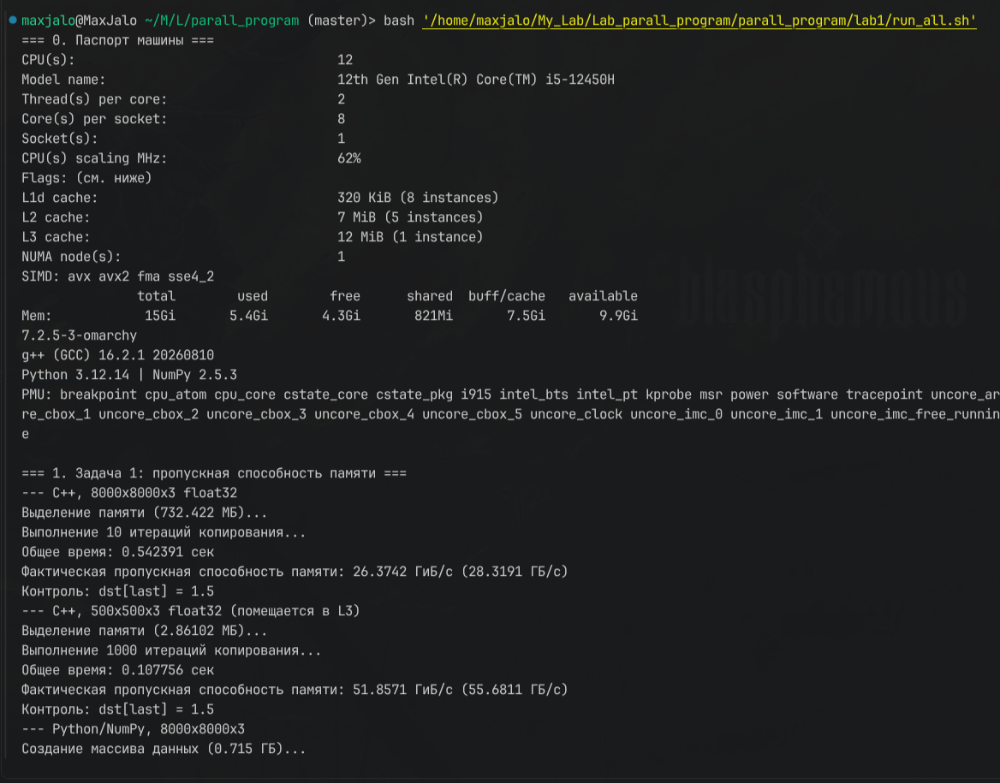
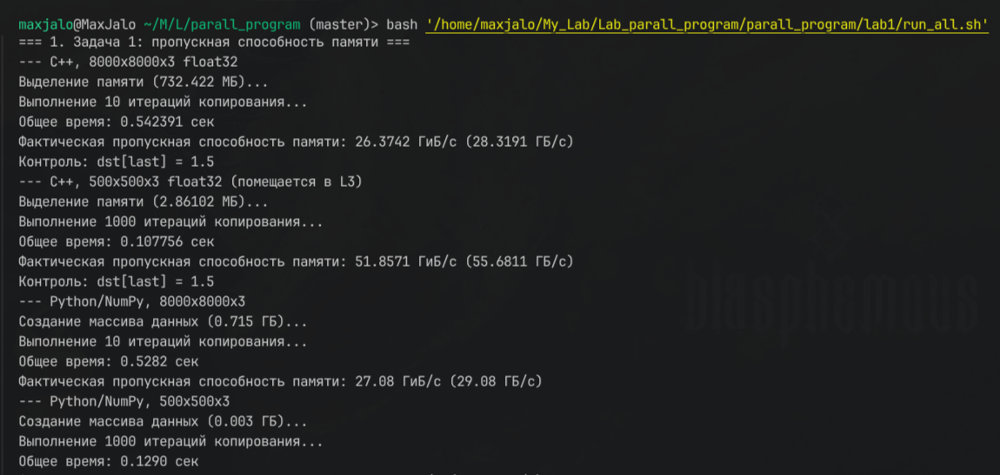
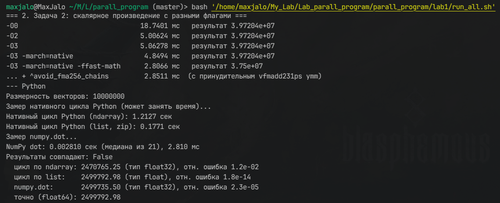
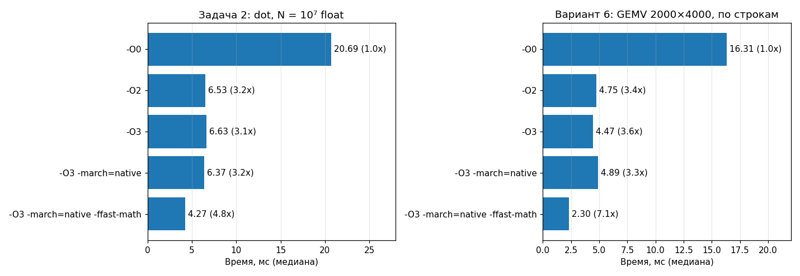
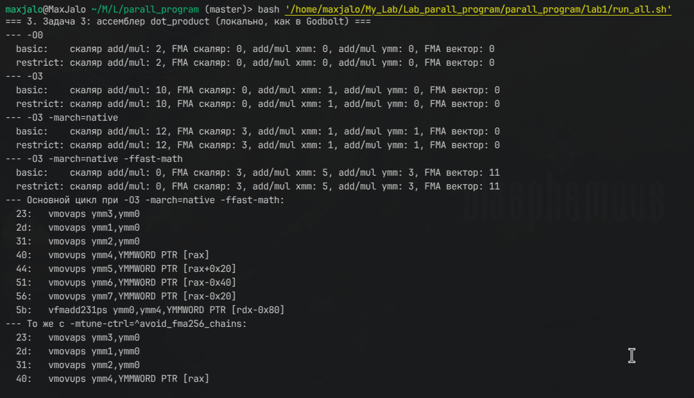
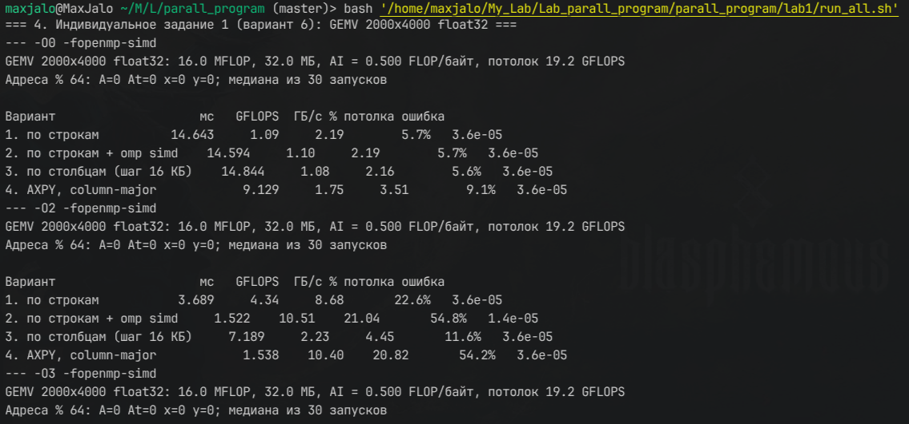
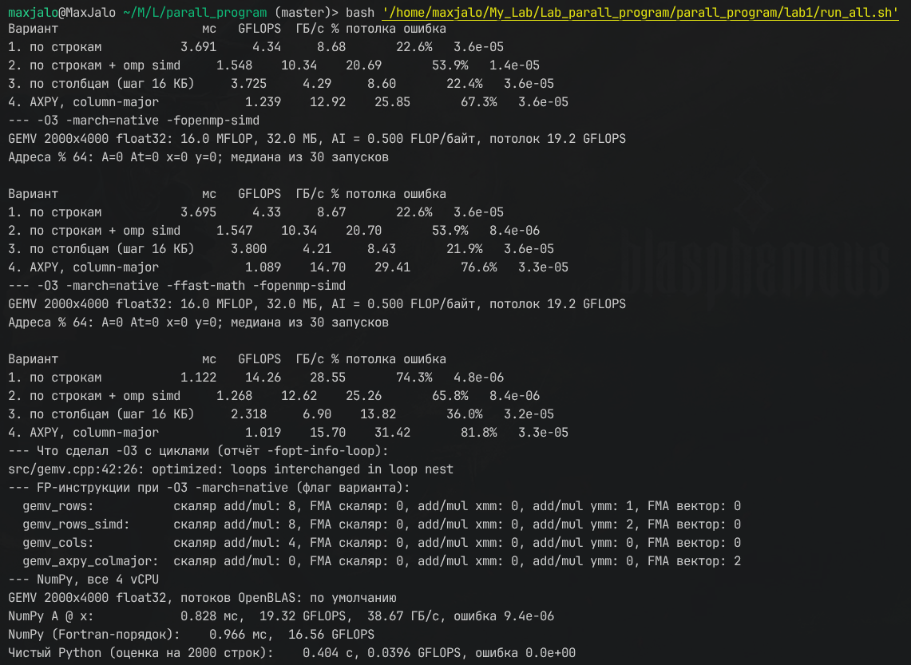
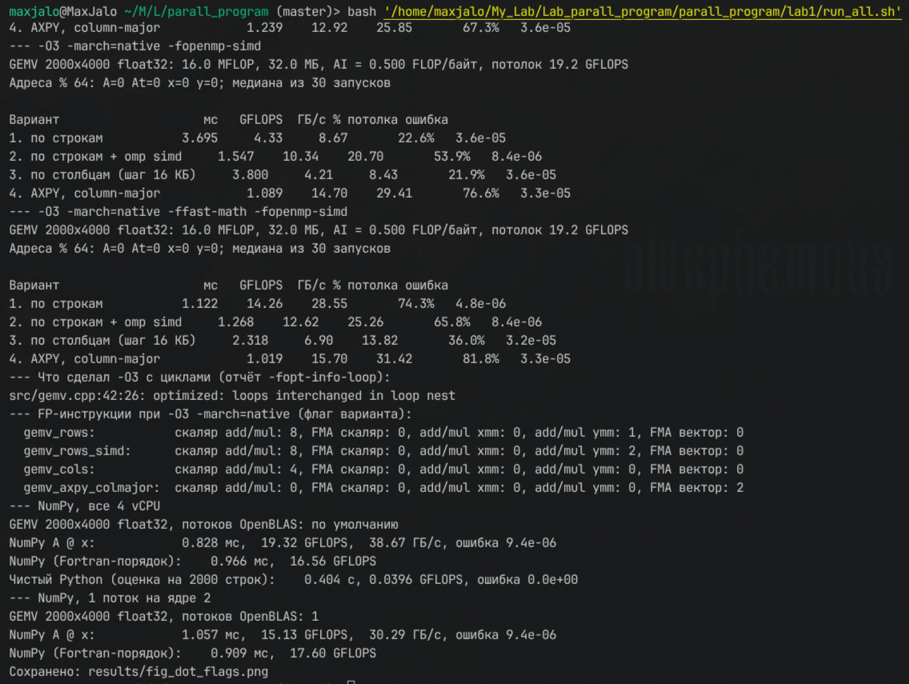

# Лабораторная работа 1. Архитектура вычислительного узла, пропускная способность памяти, оптимизация скалярного произведения

Журнал выполнения по методичке [lab_1.pdf](lab_1.pdf). Вариант **6**.

**Запуск всего сразу:**

```bash
cd lab1 && bash run_all.sh | tee results/run_all.log
```

Исходники лежат в `src/`, бинарники — в `bin/` (не в git), логи, ассемблер, CSV и графики — в `results/`.

---

## 1–2. Тема, цель и задачи

**Тема:** модель распределённой вычислительной системы для ресурсоёмких задач (обработка спутниковых снимков, ДЗЗ). Работа включает анализ архитектуры узла, замер пропускной способности памяти и оптимизацию скалярного произведения.

**Задачи:**
1. изучить характеристики вычислительного узла;
2. измерить пропускную способность памяти;
3. реализовать скалярное произведение на Python и C++ и исследовать флаги g++;
4. разобрать ассемблер в Compiler Explorer;
5. сделать выводы.

---

## 3. Программное и аппаратное обеспечение (паспорт машины)

**Теория.** Методичка рассчитана на сервер или десктоп с двух- или четырёхканальной памятью и Linux. У меня ноутбук с Windows и WSL2. Ниже — паспорт и ограничения этой среды.

**Проверка.** Раздел «0» в `run_all.sh`: `lscpu`, `/proc/cpuinfo`, `free`, версии инструментов.

**Результат:**

| Параметр | Значение |
|---|---|
| CPU | Intel Core i5-12450H (Alder Lake, 4 P-ядра + 4 E-ядра, 12 потоков, до 4.4 ГГц) |
| Видно в WSL | 4 логических CPU (2 ядра × 2 потока), 1 сокет, 1 NUMA-узел |
| Кэши (на одно P-ядро) | L1d 48 КБ, 12-way; L2 1.25 МБ, 10-way; L3 12 МБ общий; линия 64 байта |
| SIMD | SSE4.2, AVX, AVX2, FMA; **AVX-512 нет** |
| Память | 1 × 16 ГБ DDR5-4800 (**один канал**); WSL-машине выделено 3.8 ГБ |
| ОС | Ubuntu 24.04 в WSL2, ядро 6.18 (microsoft-standard-WSL2) |
| Компилятор | g++ 13.3.0 |
| Python | 3.10, NumPy 2.2.6 (OpenBLAS 0.3.29) |

**Теоретические пределы одного P-ядра:**
- пропускная способность памяти: \(BW = 4800 \cdot 10^6 \times 8\ \text{байт} \times 1\ \text{канал} \times 1\ \text{сокет} = 38.4\) ГБ/с;
- пик FP32: \(2\ \text{FMA-порта} \times 8\ \text{float} \times 2\ \text{FLOP} \times 4.4\ \text{ГГц} = 140.8\) GFLOPS;
- точка перегиба Roofline: \(140.8 / 38.4 = 3.67\) FLOP/байт.

**Ограничения среды:**
- `perf` недоступен: Hyper-V не пробрасывает PMU, в `/sys/bus/event_source/devices` нет `cpu`. Счётчики `cache-misses` и `instructions` снять нельзя. Вместо них — отчёты компилятора и подсчёт инструкций по ассемблеру.
- CMake не установлен, сборка идёт скриптом `run_all.sh` (методичка допускает «CMakeLists.txt или скрипт компиляции»).
- Замеры выполнены на одном ядре (`taskset -c 2`), чтобы не мешали другие процессы.



*img_1 — раздел «0. Паспорт машины» из run_all.sh*

---

## 5. Теоретические сведения

### 5.1. Характеристики узла и пропускная способность

**Теория.** Формула из методички: \(BW = \text{частота} \times \text{байт за такт} \times \text{каналы} \times \text{сокеты}\).
- Пример из методички — 2 × EPYC 7763, 8 каналов DDR4-3200: \(3200 \cdot 10^6 \cdot 8 \cdot 8 \cdot 2 \approx 409.6\) ГБ/с. Снимок 10 ГБ читается минимум за 0.024 с, на практике в 2–3 раза дольше.
- Моя машина: 38.4 ГБ/с — в 10.7 раза меньше. Тот же снимок читался бы минимум 0.26 с.

Остальная периферия узла:
- **PCIe 4.0 x16** — около 32 ГБ/с: NVMe и GPU.
- **InfiniBand HDR** — 200 Гбит/с; RoCEv2 работает поверх Ethernet. Обе технологии поддерживают **RDMA**: сетевая карта пишет прямо в RAM другого узла, минуя его CPU и ОС.

### 5.2. Скалярное произведение в ДЗЗ

**Теория.** \(S = \sum_{i=1}^{N} a_i b_i\). В методе спектрального угла (SAM) пиксель \([1200, 800, 400]\) сравнивают с эталоном растительности \([1000, 700, 300]\): \(S = 1\,200\,000 + 560\,000 + 120\,000 = 1\,880\,000\). Снимок 10000 × 10000 требует \(10^8\) таких произведений.

На 2 FLOP (умножение и сложение) приходится 2 прочитанных числа, то есть 8 байт для float. Отсюда \(AI = 0.25\) FLOP/байт — **memory-bound**.

### 5.3. Флаги g++

| Флаг | Действие |
|---|---|
| `-O0` | без оптимизаций, каждая переменная хранится в памяти (стеке) |
| `-O2` | стандартные оптимизации; в GCC 12+ сюда входит и векторизация с «дешёвой» моделью стоимости |
| `-O3` | агрессивные оптимизации: полная векторизация, перестановка циклов (loop interchange), раскрутка |
| `-march=native` | инструкции текущего CPU: AVX2 и FMA на моей машине |
| `-ffast-math` | разрешает нарушать IEEE 754: менять порядок сложений, не учитывать NaN, Inf и FP-исключения |
| `-funroll-loops` | раскрутка циклов: меньше проверок условия и переходов |

### 5.4. Способы замера времени

- **Python:** `time.perf_counter()` — монотонные часы, их не сдвигает NTP.
- **C++:** методичка советует `high_resolution_clock`, но в libstdc++ это псевдоним `system_clock`, а его может сдвинуть NTP (вопрос 25 теста). Поэтому везде используется **`std::chrono::steady_clock`**.
- **perf stat** в WSL2 недоступен (см. раздел 3).
- Один замер в миллисекундном диапазоне сильно шумит, поэтому беру **медиану** из 21–30 запусков после прогрева.

---

## 6. Программа выполнения

### Задача 1. Замер пропускной способности памяти

**Теория.** Копирование массива — самая простая memory-bound операция: каждый байт читается один раз и один раз пишется. Объём трафика \(V = 2 \cdot N \cdot \text{sizeof}(T)\), пропускная способность \(BW = V / t\). Снимок имитируется массивом 8000 × 8000 × 3 float32 (732 МБ). Этот размер намного больше L3 (12 МБ), поэтому меряется именно RAM. Для сравнения я добавил массив 500 × 500 × 3 (2.9 МБ), который помещается в L3.

**Код.** `src/membw.cpp` — код методички с тремя правками: `steady_clock`, прогревочное копирование и размер из аргумента.

```cpp
std::vector<float> src(total_elements, 1.5f);
std::vector<float> dst(total_elements, 0.0f);
auto start_time = std::chrono::steady_clock::now();
for (int iter = 0; iter < iterations; ++iter)
    std::copy(src.begin(), src.end(), dst.begin());   // для float превращается в memmove
auto end_time = std::chrono::steady_clock::now();
double total_bytes = iterations * size_bytes * 2.0;    // чтение + запись
```

`src/membw.py` — код методички, но массив генерируется сразу во float32: `rng.random(..., dtype=np.float32)`. В оригинале `np.random.rand(...).astype(np.float32)` на пике держит в памяти ещё и float64-копию (1.5 ГБ), а WSL-машине выделено всего 3.8 ГБ.

```bash
g++ -std=c++17 -O3 -march=native src/membw.cpp -o bin/membw
taskset -c 2 ./bin/membw 8000 ; taskset -c 2 ./bin/membw 500
taskset -c 2 python3 src/membw.py 8000 ; taskset -c 2 python3 src/membw.py 500
```

**Результат** (ГБ = \(10^9\) байт; ГиБ = \(2^{30}\) байт — в этих единицах считает код методички):

| Реализация | Размер | Где данные | ГиБ/с | ГБ/с | % от 38.4 ГБ/с |
|---|---|---|---|---|---|
| C++ `std::copy` | 732 МБ | RAM | 18.37 | **19.72** | 51 % |
| NumPy `np.copyto` | 732 МБ | RAM | 18.39 | **19.75** | 51 % |
| C++ `std::copy` | 2.9 МБ | L3 | 43.23 | 46.42 | — |
| NumPy `np.copyto` | 2.9 МБ | L3 | 40.20 | 43.16 | — |



*img_2 — вывод bin/membw 8000 и bin/membw 500*



*img_3 — вывод membw.py 8000 и membw.py 500*

**Выводы.**
1. Одно ядро выжимает из памяти ~19.7 ГБ/с — **51 % теоретического максимума**. Причин несколько: один поток не держит в полёте достаточно запросов, чтобы загрузить контроллер памяти; запись требует сначала прочитать линию в кэш (write-allocate), и реальный трафик ближе к \(3N\), а не \(2N\); сказываются накладные расходы гипервизора. Методичка сравнивает с 50 ГБ/с для двухканальной DDR4-3200. У меня один канал DDR5-4800, поэтому потолок сам по себе ниже: 38.4 ГБ/с.
2. **C++ и NumPy на большом массиве показывают одинаковый результат**: оба вызывают один и тот же `memmove` из glibc, а упираются в шину памяти, а не в язык.
3. Когда массив помещается в L3, скорость вырастает в 2.3 раза (43–46 ГБ/с). NumPy здесь чуть медленнее (−7 %): на коротком вызове заметнее накладные расходы интерпретатора (~1 мкс на вызов `np.copyto`) при времени самого копирования ~130 мкс.
4. Для конвейера ДЗЗ это значит: один проход по снимку 732 МБ стоит минимум ~37 мс на ядро только на перенос данных, сколько бы ни стоила арифметика.

---

### Задача 2. Скалярное произведение с разными флагами компиляции

**Теория.** Для \(N = 10^7\) float два вектора занимают 80 МБ и данные идут из RAM. \(AI = 0.25\) FLOP/байт, потолок Roofline — \(38.4 \cdot 0.25 = 9.6\) GFLOPS. С практической пропускной способностью из Задачи 1 (19.7 ГБ/с) реалистичный потолок — ~4.9 GFLOPS, то есть **~4.1 мс** на одно произведение.

**Код.** `src/dot.cpp` — функция `dot_product` из методички без изменений. Исправления в `main`:
- **`10_000_000` в C++ не компилируется** — это синтаксис Python. В C++14 и новее разделитель разрядов — апостроф: `10'000'000`;
- `steady_clock` вместо `high_resolution_clock`;
- медиана из 21 запуска.

```cpp
float dot_product(const float* a, const float* b, size_t n) {
    float sum = 0.0f;
    for (size_t i = 0; i < n; ++i) sum += a[i] * b[i];
    return sum;
}
```

`src/dot.py` — код методички. Добавлены цикл по обычным спискам (`list`), медиана для `numpy.dot` и печать ошибок относительно точного значения в float64.

```bash
for f in "-O0" "-O2" "-O3" "-O3 -march=native" "-O3 -march=native -ffast-math"; do
    g++ -std=c++17 $f src/dot.cpp -o bin/dot && taskset -c 2 ./bin/dot
done
taskset -c 2 python3 src/dot.py
```

**Результат: C++** (медиана из 21, a = 1.5, b = 2.5, точный ответ 37 500 000):

| Флаги | Время, мс | Ускорение к `-O0` | GFLOPS | ГБ/с | Результат |
|---|---|---|---|---|---|
| `-O0` | 20.69 | 1.0× | 0.97 | 3.9 | 39 720 400 |
| `-O2` | 6.53 | 3.2× | 3.06 | 12.3 | 39 720 400 |
| `-O3` | 6.63 | 3.1× | 3.02 | 12.1 | 39 720 400 |
| `-O3 -march=native` | 6.37 | 3.2× | 3.14 | 12.6 | 39 720 400 |
| `-O3 -march=native -ffast-math` | **4.27** | **4.8×** | **4.68** | **18.7** | 37 763 000 |
| … + FMA принудительно (задача 3) | 4.52 | 4.6× | 4.42 | 17.7 | — |

**Результат: Python** (\(N = 10^7\), случайные числа):

| Реализация | Время | Отн. ошибка |
|---|---|---|
| цикл `for` по `ndarray` | 1.344 с | \(1.2 \cdot 10^{-2}\) |
| цикл `for` по `list` (zip) | 0.281 с | \(1.8 \cdot 10^{-14}\) |
| `numpy.dot` | **4.36 мс** (в 308 раз быстрее цикла) | \(2.3 \cdot 10^{-5}\) |





*img_4 — раздел «2»: таблица времени C++ по флагам*



*img_5 — вывод dot.py*

**Выводы.**
1. **Методичка ждёт от `-O3` ускорения в 5–10 раз за счёт векторизации. На деле `-O3` не лучше `-O2`, а `-march=native` ничего не добавляет** (3.1–3.2×). Причина — редукция `sum += …` по стандарту IEEE 754 обязана выполняться строго по порядку, ведь сложение float не ассоциативно. Компилятор векторизует только умножение (`vmulps ymm`), а 8 произведений всё равно складывает в `sum` по одному через `vaddss` (задача 3). Время — ~2.8 такта на элемент: это задержка цепочки сложений, а не память.
2. Только **`-ffast-math`** разрешает переставлять сложения: 8 независимых сумм в регистре `ymm`, в конце горизонтальная свёртка. Время падает до 4.27 мс при 18.7 ГБ/с — это **95 % практической пропускной способности** из Задачи 1. Дальше не пускает память. Ускорение к `-O0` — 4.8×, и оно ограничено как раз памятью: на данных из кэша разница была бы больше (лекция 1: 36.7 GFLOPS для размера 1000).
3. **Точность.** Последовательная сумма 10⁷ одинаковых слагаемых в float даёт 39 720 400 вместо 37 500 000 — **ошибка 5.9 %**. Когда `sum` вырастает до ~\(2^{25}\), шаг между соседними float становится 2–4, и каждое прибавление 3.75 округляется. С `-ffast-math` ошибка всего 0.7 %: 8 частичных сумм растут в 8 раз медленнее. `-ffast-math` меняет результат, но здесь — в лучшую сторону.
4. **Python.** Цикл по `ndarray` в 308 раз медленнее `numpy.dot`: на каждой итерации интерпретатор создаёт объекты `np.float32`. Цикл по `list` в 4.8 раза быстрее цикла по `ndarray`: элементы списка уже готовые Python-объекты `float`. `numpy.dot` (4.36 мс) работает на уровне лучшего C++ (4.27 мс), потому что вызывает OpenBLAS с AVX2 и тоже упирается в память.
5. **Почему проверка методички печатает `Результаты совпадают: False`.** В NumPy 2 действует правило NEP 50: `0.0 + np.float32(x)` даёт `np.float32`. Весь цикл методички накапливает сумму **во float32**, и отн. ошибка 1.2 % превышает допуск `rtol=1e-4`. Цикл по спискам считает в float64, и его результат совпадает с точным.

---

### Задача 3. Ассемблер в Compiler Explorer (Godbolt)

**Теория.** Признаки векторизации в ассемблере x86:
- регистры `xmm` (128 бит), `ymm` (256 бит) или `zmm` (512 бит);
- суффиксы `ps`/`pd` (packed, вектор) вместо `ss`/`sd` (scalar, одно число);
- `vfmadd231ps` — FMA: \(a \cdot b + c\) за одну инструкцию с **одним** округлением;
- `vmovups` — загрузка без требования выравнивания.

При `-O0` каждая переменная на каждой итерации сохраняется и заново читается из стека (`[rbp-…]`).

**Код.** `src/dot_asm.cpp` — две функции из методички: `dot_product_basic` и `dot_product_restrict`.

**Порядок работы в Godbolt:**
1. Открыть [godbolt.org](https://godbolt.org) и выбрать язык C++, компилятор **x86-64 gcc 13.3** (как локальный).
2. Вставить `src/dot_asm.cpp`.
3. Флаги `-O0`: найти `movss`, `mulss`, `addss` и обращения к стеку `[rbp-…]`. Скриншот → img_6.
4. Флаги `-O3 -march=native -ffast-math`: найти `ymm`, `vmulps`, `vaddps` или `vfmadd231ps`. Скриншот → img_7.

Локально то же самое делает раздел «3» в `run_all.sh`: `g++ -S -masm=intel` сохраняет `results/dot_asm_*.s`, а `objdump` считает инструкции.

```bash
g++ -O3 -march=native -ffast-math -S -masm=intel src/dot_asm.cpp -o results/dot_asm_O3_march_native_ffastmath.s
```

**Результат: подсчёт FP-инструкций** (весь код функции, включая хвост; `basic` и `restrict` совпадают):

| Флаги | скаляр add/mul | скаляр FMA | xmm add/mul | ymm add/mul | вектор FMA |
|---|---|---|---|---|---|
| `-O0` | 2 | 0 | 0 | 0 | 0 |
| `-O3` | 10 | 0 | 1 | 0 | 0 |
| `-O3 -march=native` | 12 | 3 | 1 | 1 | 0 |
| `-O3 -march=native -ffast-math` | 0 | 3 | 6 | 2 | 1 |

**Основной цикл при `-O3 -march=native -ffast-math`:**

```text
vmovups ymm4, YMMWORD PTR [rdi+rax*1]      ; загрузить 8 float из a
vmulps  ymm0, ymm4, YMMWORD PTR [rcx+rax*1] ; умножить на 8 float из b
vaddps  ymm1, ymm1, ymm0                    ; прибавить к 8 частичным суммам
...
vextractf128 xmm3, ymm1, 0x1                ; после цикла: свёртка 8 сумм в одну
vfmadd231ps  xmm1, xmm5, XMMWORD PTR [...]  ; хвост: FMA на 4 элементах
```

**То же с `-mtune-ctrl=^avoid_fma256_chains`:**

```text
vmovups     ymm4, YMMWORD PTR [rdi+rax*1]
vfmadd231ps ymm1, ymm4, YMMWORD PTR [rcx+rax*1]   ; умножение и сложение одной инструкцией
```



*img_6 — Godbolt, флаги -O0: скалярные movss/mulss/addss и обращения к стеку*



*img_7 — Godbolt, флаги -O3 -march=native -ffast-math: ymm-регистры, vmulps/vaddps (или vfmadd231ps)*


*img_8 — раздел «3» из run_all.sh: подсчёт инструкций и основной цикл*

**Выводы.**
1. **`-O3` без `-march=native`** векторизует только до SSE (`xmm`): по умолчанию g++ собирает под базовый x86-64, где AVX нет.
2. **`-O3 -march=native`** даёт одну `vmulps ymm` (8 умножений разом), но сложения остаются скалярными: 8 последовательных `vaddss` — причина та же, что в Задаче 2, строгий порядок IEEE 754.
3. **`-ffast-math`** векторизует всё. Но в основном цикле GCC 13 ставит пару `vmulps` + `vaddps`, а **не** `vfmadd231ps`, как ждёт методичка. Причина — настройка под Alder Lake (`-mtune=alderlake`, её включает `-march=native`): флаг `avoid_fma256_chains` запрещает FMA в цепочках накопления, потому что у FMA задержка больше, чем у сложения, а цепочка ограничена именно задержкой. Если выключить этот флаг (`-mtune-ctrl=^avoid_fma256_chains`) или указать `-mtune=haswell`, появится `vfmadd231ps ymm`. Время при этом 4.52 мс против 4.27 — компилятор был прав. Для отчёта: FMA — это одно округление вместо двух (точнее) и одна инструкция вместо двух, но полезна она там, где упираются в пропускную способность FMA-портов, а не в задержку цепочки.
4. **`__restrict__` в этой функции ничего не меняет**: `a` и `b` только читаются, а читать из пересекающихся массивов безопасно. Алиасинг мешает, когда через один указатель **пишут**, а через другой читают (см. лекцию 2, раздел 4.4, и вопрос 29 теста). Утверждение из вопроса 29, будто этот `dot` не векторизуется из-за алиасинга, неверно: мешает не алиасинг, а порядок сложений.
5. Вывод методички «компилятор сам полностью векторизует простой цикл, если правильно выставить флаги» верен **с оговоркой**: для редукции нужен `-ffast-math` (или хотя бы `-fassociative-math`) либо `#pragma omp simd reduction(+:sum)` с флагом `-fopenmp-simd` — см. индивидуальное задание.

---

## 7. Индивидуальные задания

### Задание 1 (вариант 6). GEMV: \(y = A x\), float32, \(A\) размером 2000 × 4000, флаг `-O3 -march=native`

**Контекст:** ядро методов понижения размерности (PCA, случайные проекции) и полносвязных слоёв нейросетей при батче 1.

#### 1. Вычислительная сложность и арифметическая интенсивность

**Теория.** \(M = 2000\) строк, \(N = 4000\) столбцов.
- FLOP: \(2MN = 2 \cdot 2000 \cdot 4000 = 16 \cdot 10^6\) (умножение и сложение на каждый элемент \(A\)).
- Байты: \(4 \cdot (MN + N + M) = 4 \cdot (8\,000\,000 + 4000 + 2000) = 32.02\) МБ — матрица читается один раз, \(x\) и \(y\) пренебрежимо малы.
- \(AI = 16 \cdot 10^6 / 32.02 \cdot 10^6 \approx 0.50\) FLOP/байт.

#### 2. Классификация

\(AI = 0.5 \ll 3.67\) (точка перегиба), поэтому задача **memory-bound**. Это типичная операция BLAS Level 2: каждый элемент \(A\) используется ровно один раз, переиспользования нет. Матрица занимает 32 МБ, больше L3 (12 МБ), и при каждом вызове читается из RAM.

Потолки:
- теоретический: \(38.4 \cdot 0.5 = 19.2\) GFLOPS, 1.67 мс;
- практический: с одноядерными 19.7 ГБ/с из Задачи 1 — ~9.9 GFLOPS, **~1.63 мс**.

#### 3. Реализация и замер

**Код.** `src/gemv.cpp`. Все массивы выделены через `std::aligned_alloc(64, …)` с размером, округлённым до кратного 64 (этого требует `aligned_alloc`); программа печатает адреса, и `адрес % 64 = 0`. Время — `steady_clock`, **медиана из 30 запусков** после прогрева. Результат сверяется с эталоном в double. Четыре варианта обхода:

```cpp
// 1. По строкам (row-major): y[i] = строка i · x — редукция
for (size_t i = 0; i < M; ++i) {
    float sum = 0.0f;
    for (size_t j = 0; j < N; ++j) sum += A[i*N + j] * x[j];
    y[i] = sum;
}
// 2. То же + #pragma omp simd reduction(+ : sum) — разрешает векторизовать редукцию без -ffast-math
// 3. По столбцам той же row-major матрицы — внутренний цикл идёт с шагом N*4 = 16 КБ
for (size_t j = 0; j < N; ++j)
    for (size_t i = 0; i < M; ++i) y[i] += A[i*N + j] * x[j];
// 4. Матрица хранится по столбцам (At[j*M + i]): y += x[j] * столбец j — это AXPY, редукции нет
for (size_t j = 0; j < N; ++j)
    for (size_t i = 0; i < M; ++i) y[i] += At[j*M + i] * x[j];
```

`src/gemv.py` — эталон на NumPy (`A @ x`, OpenBLAS) и чистом Python (200 строк с экстраполяцией на 2000).

```bash
g++ -std=c++17 -O3 -march=native -fopenmp-simd src/gemv.cpp -o bin/gemv && taskset -c 2 ./bin/gemv
python3 src/gemv.py ; OPENBLAS_NUM_THREADS=1 taskset -c 2 python3 src/gemv.py
```

**Результат: флаг варианта `-O3 -march=native`:**

| Вариант | мс | GFLOPS | ГБ/с | % от 19.2 GFLOPS | Макс. ошибка |
|---|---|---|---|---|---|
| 1. по строкам | 4.888 | 3.27 | 6.6 | 17 % | \(3.6 \cdot 10^{-5}\) |
| 2. по строкам + `omp simd` | 2.341 | 6.83 | 13.7 | 36 % | \(8.4 \cdot 10^{-6}\) |
| 3. по столбцам | 4.798 | 3.33 | 6.7 | 17 % | \(3.6 \cdot 10^{-5}\) |
| 4. AXPY, column-major | **2.285** | **7.00** | **14.0** | **36 %** | \(3.3 \cdot 10^{-5}\) |

**Результат: все флаги** (мс, медиана из 30):

| Флаги | 1. строки | 2. строки + simd | 3. столбцы | 4. AXPY |
|---|---|---|---|---|
| `-O0` | 16.31 | 16.50 | 24.53 | 12.45 |
| `-O2` | 4.75 | 2.57 | 26.79 | 2.74 |
| `-O3` | 4.47 | 2.41 | 4.50 | 2.15 |
| **`-O3 -march=native`** | **4.89** | **2.34** | **4.80** | **2.29** |
| `-O3 -march=native -ffast-math` | 2.30 | 2.26 | 4.56 | **1.94** |

**Результат: NumPy и Python:**

| Реализация | мс | GFLOPS | ГБ/с |
|---|---|---|---|
| NumPy `A @ x`, 1 поток | 1.728 | 9.26 | 18.5 |
| NumPy `A @ x`, 4 vCPU | 1.395 | 11.47 | 23.0 |
| чистый Python (оценка) | 366 | 0.044 | — |


*img_9 — вывод bin/gemv для -O0 и -O3 -march=native*


*img_10 — вывод для -O3 -march=native -ffast-math, отчёт «loops interchanged» и подсчёт FP-инструкций*


*img_11 — вывод gemv.py (4 потока и 1 поток)*

#### 4. Анализ ассемблера

**Проверка.** Раздел «4» в `run_all.sh` считает FP-инструкции в каждой функции бинарника, собранного с `-O3 -march=native`:

| Функция | скаляр add/mul | ymm add/mul | вектор FMA | Что это значит |
|---|---|---|---|---|
| `gemv_rows` | 8 | 1 | 0 | `vmulps ymm` + 8 скалярных `vaddss`: редукция по порядку |
| `gemv_rows_simd` | 8 | 2 | 0 | `vmulps` + `vaddps ymm`: 8 частичных сумм (скаляр — это хвост) |
| `gemv_cols` | 4 | 0 | 0 | после перестановки циклов — скалярная редукция |
| `gemv_axpy_colmajor` | 0 | 0 | 2 | `vfmadd…ps ymm`: чистый векторный AXPY с FMA |

Проверить в Godbolt: вставить `gemv_rows` и `gemv_axpy_colmajor`, флаги `-O3 -march=native`. В первой функции будут `vmulps ymm` и цепочка `vaddss`, во второй — `vfmadd231ps ymm`.

Отчёт `-fopt-info-loop` для варианта 3: **`gemv.cpp:42:26: optimized: loops interchanged in loop nest`**.

#### 5. Влияние флага и выводы

1. **Флаг варианта против `-O0`:** обход по строкам ускорился с 16.31 до 4.89 мс — **в 3.3 раза**. Основной вклад дают регистры вместо стека и векторное умножение. Но **`-march=native` сам по себе ничего не дал** (`-O3` — 4.47 мс, `-O3 -march=native` — 4.89 мс, в пределах шума). Редукция в `sum` по-прежнему идёт скалярно, со скоростью ~2.7 такта на элемент (\(4.89\ \text{мс} \cdot 4.4\ \text{ГГц} / 8 \cdot 10^6\)) — это задержка цепочки `vaddss`, а не память. AVX2 здесь просто нечем загрузить.
2. **Чтобы флаг заработал, нужно убрать последовательную редукцию.** Это можно сделать тремя способами, и все они дают ~2.3 мс (≈14 ГБ/с, в 2.1 раза быстрее), то есть выход на память:
   - `-ffast-math` — глобально, для всей программы;
   - `#pragma omp simd reduction(+:sum)` + `-fopenmp-simd` — только для этого цикла, остальной код сохраняет строгий IEEE 754. Это **лучший вариант**;
   - хранить матрицу по столбцам и считать в форме AXPY (вариант 4): редукции нет вообще, и `-O3 -march=native` без всяких прагм даёт `vfmadd231ps ymm`.
3. **Порядок обхода.** При `-O0` и `-O2` обход row-major матрицы по столбцам — самый медленный (24.5–26.8 мс, в 5.6 раза хуже строк). Шаг 16 КБ означает, что каждое обращение попадает в новую кэш-линию и **новую 4-КБ страницу**, то есть это ещё и промах TLB. `-O3` включает `-floop-interchange` и **сам переставляет циклы** (отчёт «loops interchanged»): вариант 3 превращается в вариант 1 и работает те же 4.8 мс. Полагаться на это не стоит: перестановка срабатывает только на простых гнёздах циклов.
4. **Потолок.** Лучший C++ (1.94 мс, 16.5 ГБ/с) и NumPy в 1 поток (1.73 мс, 18.5 ГБ/с) подошли к практической пропускной способности одного ядра (19.7 ГБ/с). Это ~50 % теоретического потолка 19.2 GFLOPS — ровно доля, которую одно ядро берёт от шины. NumPy на 4 vCPU даёт 23 ГБ/с: больше ядер — больше запросов в полёте. Дальнейшее ускорение возможно только многопоточностью (до ~38 ГБ/с), либо если объединить несколько векторов \(x\) в матрицу — тогда GEMV превращается в GEMM и задача становится compute-bound.
5. **Точность.** Векторная редукция (варианты 2 и 4 с `-ffast-math`) даёт ошибку в 4 раза меньше (\(8.4 \cdot 10^{-6}\) против \(3.6 \cdot 10^{-5}\)) — тот же эффект частичных сумм, что в Задаче 2.
6. **Python.** Чистый Python медленнее NumPy в ~210 раз. NumPy вызывает `sgemv` из OpenBLAS и работает на уровне лучшего C++.

### Задание 2. Статистическая модель (MPI, разложение Холецкого)

*Будет выполнено позже.*

---

## 9. Контрольные вопросы

1. **Иерархия памяти и роль кэш-линии.** Регистры → L1 (48 КБ, ~1 нс) → L2 (1.25 МБ, ~3 нс) → L3 (12 МБ, общий на все ядра, ~12 нс) → RAM (~80 нс) → NVMe. Данные переносятся линиями по 64 байта. При построчном обходе растра все 16 float из линии используются. При обходе по столбцам используется 4 байта из 64, и каждое обращение — промах (вариант 3 GEMV: в 5.6 раза медленнее при `-O2`).
2. **UMA и NUMA.** В UMA все ядра обращаются к памяти одинаково быстро. В NUMA у каждого сокета своя память, а чужая медленнее в 1.5–3 раза. В системах ДЗЗ это значит: тайл снимка должен лежать в памяти того сокета, чьи потоки его обрабатывают (политика first-touch, привязка потоков). Иначе, по оценке методички, теряется 30–40 % производительности.
3. **Пропускная способность памяти.** Сколько байт в секунду подсистема памяти передаёт процессору. Теоретически: \(\text{частота} \times 8\ \text{байт} \times \text{каналы} \times \text{сокеты}\) — у меня 38.4 ГБ/с. Практически: время копирования большого массива, \(BW = 2N \cdot \text{sizeof}(T) / t\) — у меня 19.7 ГБ/с на одно ядро.
4. **SIMD и FMA.** Одна инструкция обрабатывает регистр целиком: SSE — 4 float, AVX — 8. FMA вычисляет \(a \cdot b + c\) одной инструкцией с одним округлением. В скалярном произведении это ровно шаг `sum += a[i]*b[i]`, так что FMA вдвое сокращает число арифметических инструкций и повышает точность. Но пока задача ограничена памятью, скорость упирается в загрузку данных (Задачи 2 и 3).
5. **Флаги GCC.**
   - `-O3` — векторизация, перестановка циклов (loop interchange), раскрутка.
   - `-march=native` — инструкции конкретного CPU (у меня AVX2 и FMA); бинарник может не запуститься на другом процессоре.
   - `-ffast-math` — разрешает менять порядок операций и считать, что NaN, Inf и FP-исключений нет.
   - `-funroll-loops` — дублирует тело цикла, чтобы было меньше переходов и больше независимых инструкций.

   Риски `-ffast-math` в науке: результат зависит от флагов и порядка сложения (воспроизводимость), ломаются проверки `isnan`/`isinf`, может нарушиться компенсированное суммирование (алгоритм Кэхэна).
6. **Почему Python медленнее и как спасает NumPy.** Каждая итерация цикла в Python — это интерпретация байт-кода, создание и удаление объектов и динамическая диспетчеризация типов, в сумме ~100 нс на элемент против ~0.4 нс в C++. NumPy переносит цикл целиком в скомпилированный C с SIMD и BLAS: один вызов из Python на весь массив. В Задаче 2 это ускорение в 308 раз.
7. **RDMA и InfiniBand.** RDMA — сетевая карта читает и пишет память удалённого узла без участия его CPU и ОС: нет копирования через ядро и прерываний. Задержка — порядка 1 мкс против десятков мкс у TCP поверх Ethernet, скорость — 200–400 Гбит/с против 1 Гбит/с. Для MPI-задач с частым обменом (граничные области, коллективные операции) это разница между масштабированием и простоем.
8. **Godbolt.** Сразу показывает ассемблер для любого компилятора и набора флагов и подсвечивает соответствие строк исходника и инструкций. Признаки векторизации: регистры `xmm`/`ymm`/`zmm`, суффиксы `ps`/`pd` (`vmulps`, `vaddps`), `vfmadd231ps`, `vmovups`, `vbroadcastss`, горизонтальная свёртка после цикла (`vextractf128`, `vhaddps`).
9. **Алиасинг указателей.** Два указателя могут указывать на пересекающуюся память. Если через один пишут, а через другой читают, компилятор не может менять порядок загрузок и записей. Тогда он либо не векторизует цикл, либо вставляет проверку во время выполнения («loop versioned for vectorization because of possible aliasing», лекция 2). Обход: `__restrict__`, `#pragma GCC ivdep`, локальные копии. Для функций, которые только читают (как `dot`), алиасинг не мешает.
10. **Конвейер оптимизации.**
    1. Скалярная версия и проверка корректности.
    2. Оценка FLOP, байт и AI, место на Roofline — memory- или compute-bound.
    3. Замер медианой с прогревом; сравнение с потолком.
    4. `-O3 -march=native`, отчёт `-fopt-info-vec-missed`.
    5. Ассемблер (Godbolt / `-S`): есть ли `ymm`, не скалярная ли редукция.
    6. Устранение препятствий: `__restrict__`, `omp simd reduction`, другой порядок циклов или раскладка данных, выравнивание.
    7. Повторный замер; если упёрлись в память — блокирование или многопоточность.
    8. Проверка точности после `-ffast-math`.

---

## Список скриншотов

| Файл | Что снять |
|---|---|
| `results/img_1.png` | `run_all.sh`, раздел «0. Паспорт машины» |
| `results/img_2.png` | Задача 1, вывод C++ (8000 и 500) |
| `results/img_3.png` | Задача 1, вывод Python (8000 и 500) |
| `results/img_4.png` | Задача 2, таблица C++ по флагам |
| `results/img_5.png` | Задача 2, вывод `dot.py` |
| `results/img_6.png` | Задача 3, Godbolt с `-O0` |
| `results/img_7.png` | Задача 3, Godbolt с `-O3 -march=native -ffast-math` |
| `results/img_8.png` | Задача 3, раздел «3» из `run_all.sh` (подсчёт инструкций, основной цикл) |
| `results/img_9.png` | Инд. задание, `gemv` при `-O0` и `-O3 -march=native` |
| `results/img_10.png` | Инд. задание, `-ffast-math`, «loops interchanged», подсчёт FP-инструкций |
| `results/img_11.png` | Инд. задание, вывод `gemv.py` |

График `results/fig_dot_flags.png` строится автоматически (`src/plot_flags.py`). Полный лог — `results/run_all.log`.
