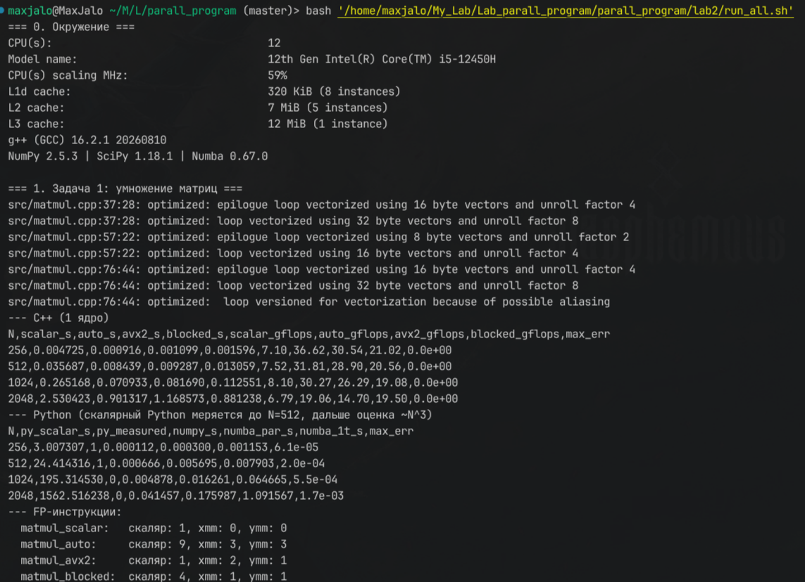
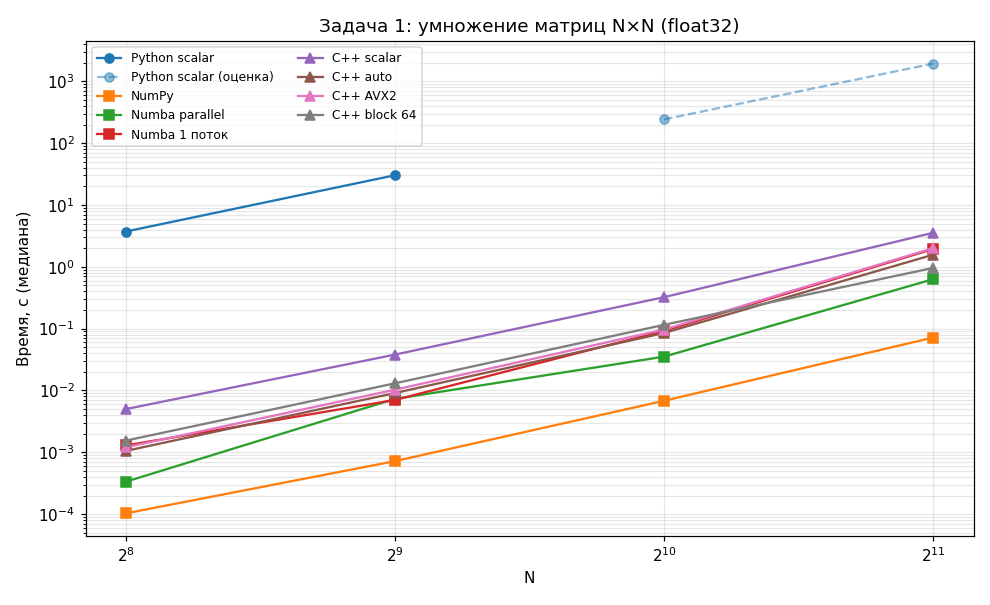
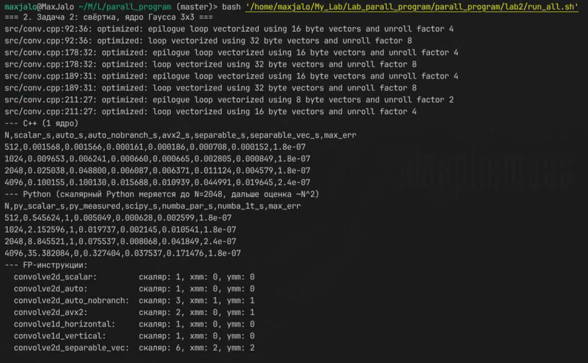
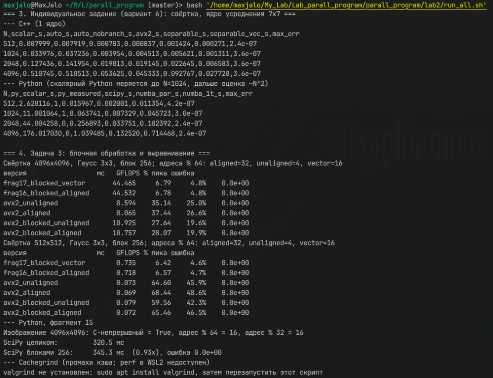
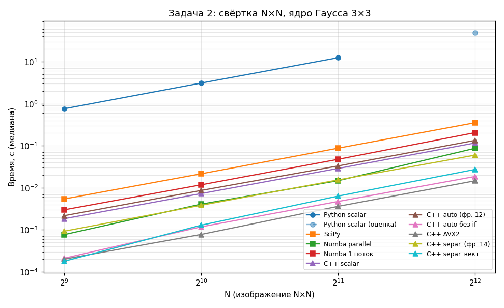
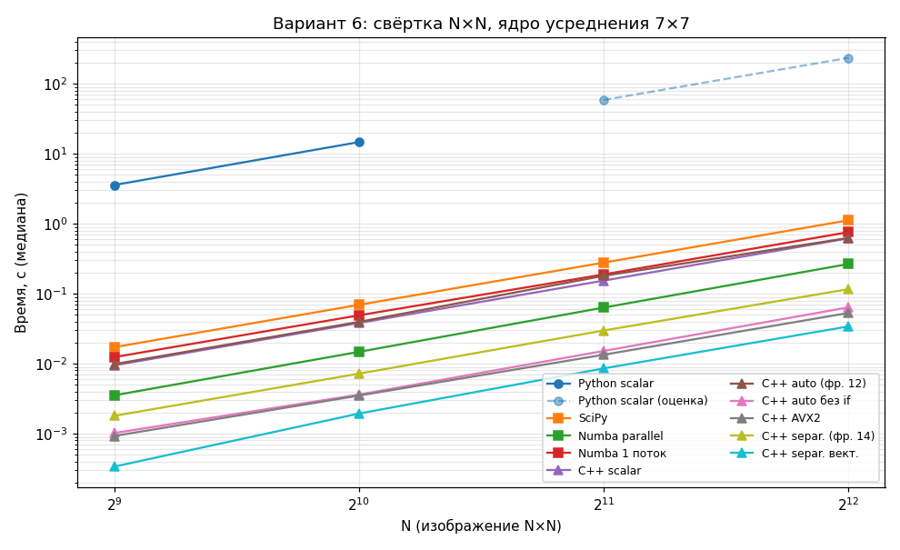

# Лабораторная работа 2. Векторизация алгоритмов обработки изображений и линейной алгебры

Журнал выполнения по методичке [lab02.pdf](lab02.pdf). Вариант **6**: свёртка с ядром усреднения 7×7.

**Запуск всего сразу** (около 3 минут; дольше всех работает скалярный Python):

```bash
cd lab2 && bash run_all.sh | tee results/run_all.log
```

Исходники лежат в `src/`, бинарники — в `bin/`, CSV, логи и графики — в `results/`. Как читать результаты:
- C++ собран с `-O3 -march=native` и запущен на одном ядре (`taskset -c 2`).
- Python запущен **без** привязки: NumPy (OpenBLAS) и Numba `parallel=True` используют все 4 vCPU WSL, как и задумано в методичке. Для честного сравнения с однопоточным C++ Numba дополнительно замерена в один поток.
- Везде указана медиана из 10 запусков (N ≤ 512), 5 (N = 1024) или 3 (N ≥ 2048) после прогрева.

---

## 1–2. Тема, цель, задачи

**Тема:** умножение матриц и двумерная свёртка — реализация с авто-векторизацией и интринсиками, анализ производительности, профилирование, выравнивание данных.

**Задачи:**
1. скалярные и векторизованные версии на Python и C++;
2. сравнение производительности;
3. профилирование: промахи кэша, утилизация векторных регистров;
4. влияние выравнивания и порядка циклов;
5. рекомендации по оптимизации.

## 3. Программное обеспечение

**Проверка.** Раздел «0» в `run_all.sh`.

| Требуется по методичке | У меня | Комментарий |
|---|---|---|
| Python 3.10+, NumPy, SciPy, Numba, Matplotlib | Python 3.10, NumPy 2.2.6, SciPy 1.15.3, Numba 0.67.0, Matplotlib 3.10 | ок |
| GCC 12+ | g++ 13.3.0 | ок |
| CPU с AVX2 / AVX-512 | i5-12450H: AVX2 + FMA, AVX-512 нет | ок для AVX2 |
| perf, VTune | **недоступны в WSL2** (нет PMU) | замена — cachegrind и подсчёт инструкций в ассемблере |
| Valgrind / Cachegrind | не установлен | `sudo apt install valgrind`, после установки `run_all.sh` снимет промахи сам |
| Clang, CMake, Cython, GDAL, OpenCV | не установлены | для заданий не нужны |
| 16 ГБ RAM | WSL-машине выделено 3.8 ГБ | самые большие массивы — 4096² × 4 байта = 64 МБ, хватает |



*img_1 — раздел «0. Окружение» из run_all.sh*

---

## 5. Теоретические сведения

### 5.1. SIMD и векторные регистры

**Теория.**

| Набор | Год | Регистр | float | double |
|---|---|---|---|---|
| SSE | 1999 | 128 бит (`xmm`) | 4 | 2 |
| AVX | 2011 | 256 бит (`ymm`) | 8 | 4 |
| AVX2 | 2013 | 256 бит (`ymm`), плюс целые и FMA (отдельный флаг) | 8 | 4 |
| AVX-512 | 2016 | 512 бит (`zmm`) | 16 | 8 |

Пик одного P-ядра моей машины: \(2\ \text{FMA-порта} \times 8\ \text{float} \times 2\ \text{FLOP} \times 4.4\ \text{ГГц} = 140.8\) GFLOPS FP32.

### 5.2. Roofline: compute-bound и memory-bound

**Теория.**
- **Умножение матриц**: \(2N^3\) FLOP на \(3N^2 \cdot 4\) байт, \(AI = N/6\) растёт с размером. Это compute-bound — **при условии, что данные переиспользуются из кэша**.
- **Свёртка** с ядром \(k \times k\): \(2k^2\) FLOP на пиксель. В идеале каждый пиксель читается и пишется один раз (8 байт), тогда \(AI = k^2/4\):
  - 3×3: 2.25 FLOP/байт, это **ниже** точки перегиба 3.67 — memory-bound;
  - 7×7: 12.25 FLOP/байт, это **выше** — compute-bound.

  Это важно для варианта 6.

### 5.3. Авто-векторизация

**Теория.** Условия:
- нет зависимостей между итерациями;
- число итераций известно;
- простые типы;
- нет вызовов невекторизуемых функций;
- **нет ветвлений во внутреннем цикле** — это видно в Задаче 2.

Флаги:
- GCC: `-O3` (векторизация включена), `-march=native`, `-fopt-info-vec-optimized` и `-fopt-info-vec-missed` — отчёты;
- Clang: `-Rpass=loop-vectorize`.

### 5.4. Интринсики

**Теория.** Заголовок `<immintrin.h>`; основные операции:
- `_mm256_load_ps` / `_mm256_loadu_ps` — загрузка с выравниванием по 32 байтам и без него;
- `_mm256_store_ps`, `_mm256_storeu_ps` — запись;
- `_mm256_fmadd_ps(a, b, c)` = \(a \cdot b + c\);
- `_mm256_set1_ps(v)` — одно значение во все 8 позиций;
- `_mm256_setzero_ps()`.

`__restrict` обещает компилятору, что указатели не пересекаются.

### 5.5. Пространственная локальность и перестановка циклов

**Теория.** C/C++ и NumPy хранят матрицы по строкам (row-major), поэтому внутренний цикл должен идти по последнему индексу. В умножении матриц порядок `i-j-k` читает \(B[k][j]\) с шагом \(N\): промах на каждом обращении, плюс скалярная редукция. Порядок `i-k-j` даёт последовательный доступ к `B` и `C`, редукции нет, и цикл векторизуется. Во всех реализациях этой работы используется `i-k-j`.

### 5.6. Модель умножения матриц

**Теория.** \(C_{ij} = \sum_{k=1}^{K} A_{ik} B_{kj}\), сложность \(O(MNK)\) — \(2N^3\) FLOP при квадратных матрицах. Блочный алгоритм \(C_{IJ} = \sum_K A_{IK} B_{KJ}\) с блоками \(B \times B\), которые помещаются в кэш: каждый загруженный блок участвует в \(B\) операциях, а не в одной.

### 5.7. Модель двумерной свёртки

**Теория.** \((I * K)(x, y) = \sum_{i=-a}^{a}\sum_{j=-b}^{b} I(x-i, y-j)\,K(i, j)\). На практике, как и в OpenCV и нейросетях, считают **кросс-корреляцию** — без переворота ядра. Для симметричных ядер (Гаусс, усреднение, Лаплас) результаты совпадают. Сложность — \(O(N^2 wh)\).

**Разделяемое ядро** \(K(i,j) = K_x(i)\,K_y(j)\) даёт два одномерных прохода: \(O(N^2 (w + h))\). Для 7×7 это 14 умножений на пиксель вместо 49, в 3.5 раза меньше. Оба ядра этой работы разделяемы:
- Гаусс 3×3 \(= [1,2,1]^T [1,2,1] / 16\);
- среднее 7×7 \(= [1/7, \dots]^T [1/7, \dots]\).

### 5.8–5.10. NumPy, Numba, профилирование

**Теория.**
- `numpy.dot` и `@` вызывают BLAS (у меня OpenBLAS 0.3.29) с SIMD и многопоточностью.
- `scipy.signal.convolve2d(image, kernel, mode='same')` — двумерная свёртка.
- `numba.njit` — JIT-компиляция через LLVM; `parallel=True` + `prange` распараллеливает цикл.
- `perf stat -e cache-references,cache-misses,instructions,cycles` и `perf record`/`annotate` в WSL2 не работают. Cachegrind (`valgrind --tool=cachegrind --cache-sim=yes`) моделирует L1 и LL-кэш программно и работает везде, но в 20–50 раз медленнее.

---

## 6.1. Задача 1. Умножение матриц

### Реализация

**Код.**
- `src/matmul.py` — фрагменты 1–3 методички, плюс Numba без `parallel` (`matmul_numba_1t`).
- `src/matmul.cpp` — фрагменты 4–7 в одной программе.

Все C++-версии собраны **с одними флагами** `-O3 -march=native -fopenmp-simd`. «Скалярная» отличается только атрибутом `optimize("no-tree-vectorize")`, так что разница показывает ровно вклад SIMD. Что изменено относительно методички:
- `steady_clock` вместо `high_resolution_clock` (в libstdc++ это `system_clock`);
- медиана вместо среднего;
- `C` обнуляется перед каждым запуском (версии 4–6 накапливают через `+=`);
- проверка: максимальное отличие от скалярной версии.

```cpp
// Фрагмент 4/5 (одинаковое тело; в 5 добавлены __restrict и #pragma omp simd)
for (int i = 0; i < M; ++i)
    for (int k = 0; k < K; ++k) {
        float a = A[i * K + k];
        for (int j = 0; j < N; ++j) C[i * N + j] += a * B[k * N + j];
    }
// Фрагмент 6: 8 элементов за итерацию
__m256 a = _mm256_set1_ps(A[i * K + k]);
for (; j <= N - 8; j += 8)
    _mm256_storeu_ps(&C[i*N + j], _mm256_fmadd_ps(a, _mm256_loadu_ps(&B[k*N + j]), _mm256_loadu_ps(&C[i*N + j])));
for (; j < N; ++j) C[i*N + j] += A[i*K + k] * B[k*N + j];   // хвост
// Фрагмент 7: то же, разбитое на блоки 64×64 по i, k, j
```

```bash
g++ -std=c++17 -O3 -march=native -fopenmp-simd src/matmul.cpp -o bin/matmul -fopt-info-vec-optimized
taskset -c 2 ./bin/matmul 256 512 1024 2048
PY_MAX=512 python3 src/matmul.py 256 512 1024 2048
```

Скалярный Python измерен для N = 256 и 512. Для 1024 и 2048 указана **оценка** по закону \(N^3\): 4 и 32 минуты соответственно.

### Результаты (Таблица 3)

**Время, секунды:**

| N | Py scalar | NumPy (4 vCPU) | Numba par. (4 vCPU) | Numba 1 поток | C++ scalar | C++ auto | C++ AVX2 | C++ block 64 |
|---|---|---|---|---|---|---|---|---|
| 256 | 3.72 | 0.000103 | 0.000335 | 0.00129 | 0.00500 | **0.00105** | 0.00121 | 0.00155 |
| 512 | 30.27 | 0.000720 | 0.00731 | 0.00702 | 0.0380 | **0.00909** | 0.0103 | 0.0131 |
| 1024 | ~242 (оценка) | 0.00681 | 0.0352 | 0.0921 | 0.323 | **0.0851** | 0.0966 | 0.115 |
| 2048 | ~1938 (оценка) | 0.0717 | 0.630 | 1.94 | 3.55 | 1.57 | 2.00 | **0.958** |

**Производительность C++, GFLOPS** (\(2N^3 / t\); пик ядра — 140.8):

| N | scalar | auto | AVX2 | block 64 |
|---|---|---|---|---|
| 256 | 6.7 | **31.8** | 27.8 | 21.7 |
| 512 | 7.1 | **29.5** | 26.1 | 20.6 |
| 1024 | 6.7 | **25.2** | 22.2 | 18.6 |
| 2048 | 4.9 | 11.0 | 8.6 | **17.9** |

**Ускорение:**

| Сравнение | 256 | 512 | 1024 | 2048 | Ожидание методички |
|---|---|---|---|---|---|
| NumPy / Py scalar | 36 000× | 42 000× | — | — | 100–1000× |
| Numba par. / Py scalar | 11 100× | 4 100× | — | — | 50–200× |
| C++ auto / C++ scalar | 4.8× | 4.2× | 3.8× | 2.3× | 4–8× |
| C++ AVX2 / C++ scalar | 4.2× | 3.7× | 3.3× | 1.8× | 8–12× |
| C++ block / C++ auto | 0.68× | 0.70× | 0.74× | **1.64×** | 1.5–2× на больших |

Все версии совпадают со скалярной C++ бит в бит; отличие Python/Numba от NumPy — до \(1.7 \cdot 10^{-3}\) при N = 2048 (разный порядок суммирования float).





*img_2 — раздел «1»: отчёт векторизации и таблица C++*



*img_3 — раздел «1»: таблица Python (NumPy, Numba, скалярный Python)*

**Профилирование.** Замена `perf`: подсчёт FP-инструкций в ассемблере (`count_fp` в `run_all.sh`):

| Функция | скаляр | xmm | ymm |
|---|---|---|---|
| `matmul_scalar` | 1 (`vfmadd…ss`) | 0 | 0 |
| `matmul_auto` | 9 (хвосты) | 3 | 3 (цикл раскручен) |
| `matmul_avx2` | 3 | 1 | 2 |
| `matmul_blocked` | 4 | 1 | 1 (векторизован с проверкой алиасинга) |


*img_4 — раздел «1»: подсчёт FP-инструкций*

### Выводы по Задаче 1

1. **Авто-векторизация не хуже интринсиков, даже чуть лучше** (31.8 против 27.8 GFLOPS). Цикл `i-k-j` с `__restrict` и `omp simd` компилятор векторизует сам и дополнительно раскручивает. Интринсики из фрагмента 6 — буквально тот же цикл, записанный вручную, без раскрутки. Вывод: интринсики нужны, когда меняется **алгоритм** (регистровое блокирование, лекция 2 — 91 % пика), а не когда им переписывают то, что компилятор и так векторизует.
2. **Ускорение ~4×, а не 8–12×.** Тело цикла — 2 загрузки (B и C) + 1 FMA + 1 запись C на 8 элементов, так что упор в порты загрузки и записи, а не в FMA. На N ≤ 1024 получается ~7 FLOP/такт из 32 возможных. Скалярная версия уже использует скалярную FMA (6.7 GFLOPS), поэтому база выше, чем предполагает методичка.
3. **На N = 2048 авто- и AVX2-версии проседают в 2.3 раза** (25 → 11 GFLOPS). Матрица B занимает 16 МБ — больше L3 (12 МБ). Для каждой строки `i` B читается целиком из RAM: \(2048 \times 16\ \text{МБ} = 34\) ГБ за 1.57 с ≈ **22 ГБ/с**, то есть ровно пропускная способность памяти одного ядра (лаб. 1). **Блочная версия** держит блок B 64×64 (16 КБ) в L1 и почти не теряет скорость: 17.9 GFLOPS, в **1.64 раза** быстрее авто-версии. Это совпадает с ожиданием методички (1.5–2×). На малых N, где всё и так в кэше, блоки только добавляют накладные расходы: внутренний цикл всего 64 итерации, и он заново проверяет алиасинг, так как у фрагмента 7 нет `__restrict`.
4. **NumPy** — 240 GFLOPS на 2048 (4 vCPU): OpenBLAS использует регистровое микро-ядро, упаковку и многопоточность. Это в 13 раз быстрее лучшей однопоточной C++-версии (блочной, 0.958 с). Ускорение NumPy относительно скалярного Python — \(4 \cdot 10^4\), что на порядки выше ожидания методички: интерпретатор тратит ~220 нс на каждую операцию `C[i, j] += a * B[k, j]`.
5. **Numba в один поток ≈ C++ auto** (7.0 против 9.1 мс на 512): LLVM векторизует тот же цикл. `parallel=True` на 4 vCPU даёт до 3.9× (N = 256), но на N = 512 выигрыша нет — вероятно, накладные расходы потоков и конкуренция за кэш двух гиперпотоков одного ядра.

---

## 6.2. Задача 2. Двумерная свёртка (ядро Гаусса 3×3)

### Реализация

**Код.**
- `src/conv.py` — фрагменты 8–10 плюс Numba в один поток.
- `src/conv.cpp` — фрагменты 11–14 и **две мои версии**.

Режим `same`, нули за границей изображения. Варианты в `conv.cpp`:

| Версия | Откуда | Суть |
|---|---|---|
| scalar | фрагмент 11 | 4 цикла, `if` на границы внутри цикла по ядру; векторизация запрещена атрибутом |
| auto | фрагмент 12 | тот же код + `__restrict` |
| **auto без if** | моя | порядок `i → ki → kj → j`: для строки выхода накапливаются \(k^2\) сдвинутых строк входа; границы вынесены в пределы `j0..j1` |
| AVX2 | фрагмент 13 | края скалярно, середина по 8 пикселей через `_mm256_fmadd_ps` |
| separable | фрагмент 14 | горизонтальный 1D-проход, затем вертикальный, с `if` во внутреннем цикле |
| **separable вект.** | моя | те же два прохода, внутренний цикл по `j` без ветвлений |

```cpp
// «auto без if»: внутренний цикл непрерывный — компилятор векторизует его
for (int ki = 0; ki < kh; ++ki) {
    int ii = i + ki - ph;  if (ii < 0 || ii >= H) continue;
    for (int kj = 0; kj < kw; ++kj) {
        const float kv = kernel[ki * kw + kj];  const int off = kj - pw;
        const int j0 = std::max(0, -off), j1 = std::min(W, W - off);
        for (int j = j0; j < j1; ++j) out[j] += in[ii * W + j + off] * kv;
    }
}
```

```bash
g++ -std=c++17 -O3 -march=native src/conv.cpp -o bin/conv -fopt-info-vec-optimized
taskset -c 2 ./bin/conv gauss3 512 1024 2048 4096
PY_MAX=2048 python3 src/conv.py gauss3 512 1024 2048 4096
```

### Результаты (Таблица 4)

**Время, секунды:**

| N | Py scalar | SciPy | Numba par. | Numba 1п. | C++ scalar | C++ auto (фр. 12) | C++ auto без if | C++ AVX2 | C++ separ. (фр. 14) | C++ separ. вект. |
|---|---|---|---|---|---|---|---|---|---|---|
| 512 | 0.758 | 0.00540 | 0.000766 | 0.00299 | 0.00183 | 0.00216 | 0.000210 | 0.000200 | 0.000924 | **0.000178** |
| 1024 | 3.10 | 0.0215 | 0.00408 | 0.0117 | 0.00727 | 0.00863 | 0.00118 | **0.000775** | 0.00383 | 0.00129 |
| 2048 | 12.42 | 0.0874 | 0.0147 | 0.0475 | 0.0288 | 0.0331 | 0.00472 | **0.00361** | 0.0153 | 0.00633 |
| 4096 | ~49.7 (оценка) | 0.353 | 0.0869 | 0.205 | 0.116 | 0.134 | 0.0185 | **0.0146** | 0.0598 | 0.0273 |

**Ускорение на 4096:**
- относительно C++ scalar: auto (фр. 12) — **0.87×**, auto без if — 6.3×, **AVX2 — 7.9×**, separable (фр. 14) — 1.9×, separable вект. — 4.3×;
- относительно Python (N = 2048, измерено): SciPy — 142×, Numba parallel — 845×, Numba 1 поток — 261×, C++ AVX2 — 3440×.

Ожидания методички:
- SciPy 100–500× — **выполнено**;
- Numba 50–150× — **превышено**;
- C++ auto 3–6× — **не выполнено** для фрагмента 12, выполнено для моей версии;
- AVX2 6–10× — **выполнено**;
- разделяемое ядро 1.5–2× — **не выполнено** для 3×3.

Все C++-версии совпадают со скалярной с точностью \(2.4 \cdot 10^{-7}\) (порядок сложения float).




*img_5 — раздел «2»: отчёт векторизации и таблица C++*


*img_6 — раздел «2»: таблица Python и подсчёт FP-инструкций*

**Профилирование: какие функции векторизованы.** По отчёту `-fopt-info-vec-optimized` и подсчёту ymm-инструкций:

| Функция | ymm-инструкции | Отчёт компилятора |
|---|---|---|
| `convolve2d_scalar` (фр. 11) | 0 | — (запрещено) |
| `convolve2d_auto` (фр. 12) | **0** | **не векторизована** |
| `convolve2d_auto_nobranch` | 1 | `conv.cpp:92: loop vectorized using 32 byte vectors` |
| `convolve2d_avx2` (фр. 13) | 1 | интринсики |
| `convolve1d_horizontal/vertical` (фр. 14) | **0** | **не векторизованы** |
| `convolve2d_separable_vec` | 2 | `conv.cpp:178, 189: loop vectorized using 32 byte vectors` |

### Выводы по Задаче 2

1. **Фрагмент 12 («авто-векторизация») не векторизуется совсем и работает на 15 % медленнее скалярного.** Внутренний цикл идёт по элементам ядра (3 итерации) и содержит `if` на границы; `__restrict` здесь не помогает. Компилятор не может векторизовать ни короткий цикл с ветвлением, ни внешний цикл по `j`, внутри которого два вложенных цикла. Чтобы авто-векторизация сработала, код нужно **переструктурировать**: вынести проверки границ из внутреннего цикла и сделать внутренним цикл по `j`. Моя версия «auto без if» так и сделана и даёт 6.3× — почти как интринсики.
2. **AVX2 (фрагмент 13) — лучший результат для 3×3**: 20.6 GFLOPS на 4096. Сумма 8 пикселей копится в регистре, выход пишется один раз. В версии «auto без if» каждая из 9 итераций читает и пишет строку выхода.
3. **Разделяемое ядро для 3×3 не окупается.** Операций 6 вместо 9 (всего в 1.5 раза меньше), а появляется второй проход по памяти через временный буфер (64 МБ на 4096). У 3×3 \(AI = 2.25\) — ниже точки перегиба, задача упирается в память, и лишний проход съедает выигрыш: 27.3 мс против 14.6 у AVX2. Фрагмент 14 к тому же не векторизован (`if` во внутреннем цикле) и даёт только 1.9×.
4. **Python:** SciPy в 142 раза быстрее скалярного Python, но в 24 раза медленнее C++ AVX2. `convolve2d` в SciPy — универсальная реализация без SIMD-специализации под маленькие ядра. Numba в один поток — на уровне скалярного C++: с `if` внутри LLVM тоже не векторизует.

---

## 6.3. Задача 3. Блочная обработка и выравнивание данных

### Реализация

**Код.**
- `src/blocking.cpp`: фрагменты 16 и 17 и четыре AVX2-версии.
- `src/blocking.py`: фрагмент 15 и проверка выравнивания массивов NumPy.

**Проблема методички.** Фрагменты 16 и 17 содержат **один и тот же скалярный код** с `if` во внутреннем цикле; отличается только выделение памяти (`aligned_alloc(32)` против `std::vector`). Такой код не использует векторных загрузок, так что влияние выравнивания на нём не видно в принципе. Поэтому я добавил AVX2-свёртку Гаусса 3×3 в четырёх вариантах:
- **unaligned** — буфер сдвинут на 4 байта от границы 64 байт: каждая вторая 32-байтная загрузка пересекает кэш-линию, используются `loadu`/`storeu`;
- **aligned** — `aligned_alloc(32)`; векторная часть идёт по `j`, кратным 8, поэтому центральная загрузка и запись идут через `_mm256_load_ps`/`_mm256_store_ps` (на невыровненном адресе упали бы с segfault);
- **blocked** — то же, но изображение обходится плитками 256×256 (шаг 1 методички).

```cpp
__m256 c = ALIGNED ? _mm256_load_ps(row) : _mm256_loadu_ps(row);
sum = _mm256_fmadd_ps(_mm256_loadu_ps(row - 1), kv[ki][0], sum);   // соседи всегда невыровнены
sum = _mm256_fmadd_ps(c,                        kv[ki][1], sum);
sum = _mm256_fmadd_ps(_mm256_loadu_ps(row + 1), kv[ki][2], sum);
...
if (ALIGNED) _mm256_store_ps(out + i*W + j, sum); else _mm256_storeu_ps(out + i*W + j, sum);
```

```bash
g++ -std=c++17 -O3 -march=native src/blocking.cpp -o bin/blocking
taskset -c 2 ./bin/blocking all 4096 ; taskset -c 2 ./bin/blocking all 512
python3 src/blocking.py 4096
# после sudo apt install valgrind:
valgrind --tool=cachegrind --cache-sim=yes ./bin/blocking one avx2_aligned 2048
```

### Результаты (Таблица 5)

**4096×4096** (64 МБ — не помещается в кэш), медиана из 7 запусков:

| Версия | Время, мс | GFLOPS | % пика (утилизация AVX2) | Cache-misses (D1 / LLd) |
|---|---|---|---|---|
| Фр. 17: блочная, `std::vector` | 59.8 | 5.05 | 3.6 % (скалярный код) | *после установки valgrind* |
| Фр. 16: блочная, `aligned_alloc(32)` | 58.8 | 5.13 | 3.6 % (скалярный код) | *после установки valgrind* |
| AVX2 без выравнивания | **10.08** | **29.96** | **21.3 %** | *после установки valgrind* |
| AVX2 с выравниванием | 10.56 | 28.59 | 20.3 % | *после установки valgrind* |
| AVX2 блочная | 13.38 | 22.57 | 16.0 % | *после установки valgrind* |
| AVX2 блочная + выравнивание | 13.26 | 22.77 | 16.2 % | *после установки valgrind* |

**512×512** (1 МБ на вход и 1 МБ на выход — помещается в L2 и L3):

| Версия | Время, мс | GFLOPS | % пика |
|---|---|---|---|
| AVX2 без выравнивания | 0.084 | 56.3 | 40.0 % |
| AVX2 с выравниванием | **0.073** | **64.5** | **45.8 %** |
| AVX2 блочная | 0.089 | 52.9 | 37.6 % |
| AVX2 блочная + выравнивание | 0.091 | 51.8 | 36.8 % |

**Python (фрагмент 15), 4096:** SciPy целиком — 358 мс, блоками 256 — 381 мс (**0.94×**). Массив `np.zeros((H, W), dtype=np.float32, order='C')` — C-непрерывный, но **адрес % 32 = 16**: NumPy гарантирует только 16-байтное выравнивание, а не 32, как предполагает методичка.

«Утилизация AVX2» здесь — доля пика 140.8 GFLOPS. Счётчик `fp_arith_inst_retired.256b_packed_single` в WSL2 недоступен.


*img_7 — раздел «4»: таблицы blocking для 4096 и 512*


*img_8 — раздел «4»: вывод blocking.py*


*img_9 — раздел «4»: вывод cachegrind (снять после `sudo apt install valgrind` и повторного запуска run_all.sh)*

### Выводы по Задаче 3

1. **Выравнивание: 0 % на больших данных и +15 % на данных в кэше.** На 4096 разница в пределах шума: время определяется подачей данных из RAM, а на Alder Lake невыровненная загрузка стоит столько же, сколько выровненная, если не пересекает линию. На 512, где изображение в L2, выровненная версия быстрее на 15 %. Это совпадает с ожиданием методички (5–15 %) и с замером в лекции 2 (штраф за split load до 1.8× в L2). Соседние загрузки `row ± 1` в свёртке невыровнены **всегда**, так что выравнивание помогает только центральной загрузке и записи.
2. **Блочная обработка для свёртки 3×3 замедляет** на 26–33 % (C++) и на 6 % (SciPy). Для свёртки рабочее множество одной строки выхода — это 3 строки входа (3 × 16 КБ на 4096). Они и так лежат в L1/L2, а аппаратный предвыборщик идеально обслуживает построчный проход. Плитки 256×256 рвут этот поток каждые 1 КБ и заставляют перечитывать граничные строки (гало). Блокирование окупается там, где у данных **много** переиспользований: в умножении матриц (Задача 1, N = 2048: 1.64×), но не в свёртке с маленьким ядром.
3. **Фрагменты 16 и 17 дают одинаковое время** (58.8 и 59.8 мс): код скалярный, и выравнивание ему безразлично. Замена скалярного кода на AVX2 даёт в 6 раз больше, чем любые манипуляции с памятью.
4. **Промахи кэша.** Колонка заполнится после установки valgrind. Ожидаю, что блочная версия покажет **не меньше** промахов LLd: данные читаются последовательно по одному разу, а блоки добавляют перечитывание гало.

---

## 7. Индивидуальное задание (вариант 6). Свёртка с ядром усреднения 7×7

**Теория.** Ядро \(K = \frac{1}{49}\mathbf{1}_{7 \times 7}\) — box-фильтр, сглаживание шума на снимке. Оно **разделяемо**: \(K = k k^T\), \(k = \frac{1}{7}[1,1,1,1,1,1,1]\).

| | 2D-свёртка | Разделяемая |
|---|---|---|
| Умножений на пиксель | 49 | 7 + 7 = **14** (в 3.5 раза меньше) |
| FLOP на пиксель | 98 | 28 |
| AI при идеальном кэше | \(98/8 = 12.25\) — **compute-bound** | \(14/8 = 1.75\) на каждый проход — memory-bound |

**Реализация.** Та же `src/conv.cpp` с аргументом `box7`: все шесть C++-версий, включая AVX2 из фрагмента 13 (он общий для любого размера ядра) и обе разделяемые. Python — `src/conv.py box7`: скалярный Python, SciPy, Numba parallel и Numba в 1 поток.

```bash
taskset -c 2 ./bin/conv box7 512 1024 2048 4096
PY_MAX=1024 python3 src/conv.py box7 512 1024 2048 4096
```

Скалярный Python измерен до N = 1024, для 2048 и 4096 — оценка по \(N^2\) (~1 и ~4 минуты).

### Результаты

**Время, секунды:**

| N | Py scalar | SciPy | Numba par. | Numba 1п. | C++ scalar | C++ auto (фр. 12) | C++ auto без if | C++ AVX2 | C++ separ. (фр. 14) | C++ separ. вект. |
|---|---|---|---|---|---|---|---|---|---|---|
| 512 | 3.57 | 0.0172 | 0.00353 | 0.0124 | 0.00946 | 0.00984 | 0.00102 | 0.000926 | 0.00180 | **0.000338** |
| 1024 | 14.67 | 0.0693 | 0.0148 | 0.0490 | 0.0381 | 0.0395 | 0.00361 | 0.00350 | 0.00720 | **0.00194** |
| 2048 | ~58.7 (оценка) | 0.278 | 0.0633 | 0.188 | 0.154 | 0.180 | 0.0152 | 0.0134 | 0.0298 | **0.00855** |
| 4096 | ~234.7 (оценка) | 1.118 | 0.265 | 0.757 | 0.617 | 0.625 | 0.0637 | 0.0530 | 0.116 | **0.0340** |

**Ускорение относительно C++ scalar (N = 4096):**

| auto (фр. 12) | auto без if | AVX2 | separable (фр. 14) | separable вект. |
|---|---|---|---|---|
| 0.99× | 9.7× | 11.7× | 5.3× | **18.2×** |

**Ускорение относительно скалярного Python (N = 1024, измерено):**

| SciPy | Numba par. | Numba 1п. | C++ scalar | C++ AVX2 | C++ separ. вект. |
|---|---|---|---|---|---|
| 212× | 991× | 299× | 385× | 4190× | **7560×** |

**Производительность на 4096:**
- AVX2: \(98 \cdot 4096^2 / 0.0530 = 31.0\) GFLOPS (22 % пика);
- separable вект.: реально \(28 \cdot 4096^2 / 0.034 = 13.8\) GFLOPS, но в пересчёте на 2D-эквивалент (98 FLOP на пиксель) — **48.3 GFLOPS**.




*img_10 — раздел «3»: таблица C++ для box7*


*img_11 — раздел «3»: таблица Python для box7*

### Выводы по варианту 6

1. **Для 7×7 разделяемое ядро — лучший вариант**: 34 мс против 53 мс у AVX2, дополнительно **1.56×** — в диапазоне ожидания методички (1.5–2×). У 2D-свёртки 7×7 \(AI = 12.25\), она compute-bound, так что сокращение операций в 3.5 раза напрямую ускоряет работу. Меньше 3.5×, потому что каждый 1D-проход уже memory-bound (\(AI = 1.75\)) и добавляется лишний проход по временному буферу. Для 3×3 (Задача 2) тот же приём проигрывает: там сокращение всего 1.5×, а задача и без того упирается в память.
2. **Порядок выбора метода зависит от размера ядра:**
   - маленькое ядро (3×3) — одна 2D-свёртка на интринсиках, один проход по памяти;
   - большое разделяемое ядро (7×7 и больше) — два векторизованных 1D-прохода.
3. **Для box-фильтра есть ещё более быстрый путь** — скользящая сумма (running sum): при сдвиге окна на один пиксель добавляется входящий столбец и вычитается уходящий. Это \(O(1)\) на пиксель независимо от размера ядра (2 сложения вместо 7 на проход). В этой работе не реализовано, но это следующий шаг оптимизации.
4. **Фрагменты методички без переработки не векторизуются:** фрагмент 12 даёт 0.99×, фрагмент 14 — только 5.3× за счёт сокращения операций. Код с `if` во внутреннем цикле компилятор оставляет скалярным при любых флагах; нужны перестановка циклов и вынос граничных условий (версии «без if» и «вект.»: 9.7× и 18.2×).
5. **Numba parallel на 4 vCPU** быстрее скалярного C++ в 2.3 раза, но в 7.8 раза медленнее разделяемой C++-версии на одном ядре. Лучший однопоточный C++ быстрее SciPy в **33 раза**.

---

## 9. Контрольные вопросы

1. **SIMD и его преимущества в обработке изображений.** Одна инструкция обрабатывает 8 float (AVX2) или 16 (AVX-512). Пиксели изображения независимы и лежат в памяти подряд — идеальный случай для SIMD. На свёртке у меня ускорение 7.9× (3×3) и 11.7× (7×7) относительно скалярного кода.
2. **Наборы SIMD x86-64.** SSE (1999, 128 бит, 4 float), AVX (2011, 256 бит, трёхоперандная форма VEX), AVX2 (2013, целочисленные операции на 256 битах, gather; FMA — отдельный флаг), AVX-512 (2016, 512 бит, 16 float, регистры масок `k0–k7`). Различаются шириной регистра, набором операций и поддержкой масок.
3. **Условия авто-векторизации.** Число итераций известно; нет зависимостей между итерациями; доступ к памяти последовательный; нет вызовов невекторизуемых функций; нет ветвлений во внутреннем цикле (фрагмент 12 не векторизуется именно из-за `if`); нет возможного перекрытия указателей (`__restrict`); для редукций — разрешено переупорядочивание (`-ffast-math` или `omp simd reduction`).
4. **`_mm256_load_ps` и `_mm256_loadu_ps`.** `load` требует адрес, кратный 32, иначе программа падает (segfault). `loadu` работает с любым адресом. На современных CPU (Haswell+, Zen+) по выровненному адресу они стоят одинаково; штраф есть только за пересечение кэш-линии: +15 % на данных в L2, ~0 % на данных из RAM (Задача 3).
5. **Как FMA повышает производительность.** \(a \cdot b + c\) одной инструкцией: вдвое меньше арифметических инструкций, два FMA-порта дают 32 FLOP/такт на FP32. Одно округление вместо двух повышает точность. Эффект заметен в compute-bound коде (микро-ядро из лекции 2 — 91 % пика), а в memory-bound упор в память.
6. **Модель свёртки, сложность, отличие от кросс-корреляции.** \((I * K)(x,y) = \sum_i\sum_j I(x-i, y-j)K(i,j)\), сложность \(O(N^2 wh)\). Кросс-корреляция использует \(I(x+i, y+j)\), то есть ядро не переворачивается. Для симметричных ядер (Гаусс, box, Лаплас) результаты совпадают; для Собеля отличаются знаком.
7. **Преимущество разделяемых ядер.** \(O(N^2(w + h))\) вместо \(O(N^2 wh)\): для 7×7 — 14 умножений вместо 49. Выигрыш реален, когда 2D-свёртка compute-bound (большое ядро): 1.56× к AVX2 для 7×7. Для 3×3 лишний проход по памяти съедает выгоду.
8. **Метрики `perf stat`.** `cycles`, `instructions` (их отношение IPC показывает, насколько загружен конвейер), `cache-references` и `cache-misses` (доля промахов, методичка считает 15 % «красным флагом»), `fp_arith_inst_retired.{scalar,256b_packed}_single` (доля векторных FP-операций), `mem_uops_retired.split_loads` (невыровненные загрузки через границу линии). В WSL2 `perf` недоступен; замены — cachegrind (промахи D1 и LL), подсчёт инструкций в ассемблере и доля пика по GFLOPS.
9. **Влияние выравнивания.** Позволяет использовать `load`/`store` вместо `loadu`/`storeu` и исключает split load. На Alder Lake — +15 % для данных в кэше, 0 % для потоковой обработки из RAM. Важнее самого выравнивания векторизовать код (6× в Задаче 3).
10. **Roofline.** \(P = \min(\pi, \beta \cdot AI)\). Compute-bound: умножение матриц (\(AI = N/6\)), свёртка 7×7 (\(AI \approx 12\)). Memory-bound: свёртка 3×3 (\(AI \approx 2.25\)), GEMV (0.5), скалярное произведение (0.25), копирование.
11. **Почему порядок циклов критичен для умножения матриц.** В `i-j-k` элемент `B[k][j]` читается с шагом \(N \cdot 4\) байт: промах кэша и TLB на каждом обращении, плюс скалярная редукция. В `i-k-j` доступ к `B` и `C` последовательный, редукции нет, и цикл векторизуется без `-ffast-math` (все C++-версии в Задаче 1). GCC с `-O3` иногда сам переставляет циклы (лаб. 1, GEMV: «loops interchanged»), но полагаться на это нельзя.
12. **Рекомендации по оптимизации обработки снимков.**
    - начинать с оценки \(AI\) и места на Roofline;
    - убирать ветвления и граничные условия из внутреннего цикла;
    - делать внутренним цикл по непрерывному индексу;
    - проверять векторизацию отчётом `-fopt-info-vec` и ассемблером;
    - для больших разделяемых ядер — два 1D-прохода, для box — скользящая сумма;
    - для маленьких ядер — один векторный проход, **без** блоков;
    - для умножения матриц — блоки под L1/L2 плюс регистровое микро-ядро, а лучше готовый BLAS;
    - выравнивать буферы по 32 или 64 байта (дёшево, до +15 %);
    - на Python — NumPy/SciPy для типовых операций и Numba для своих циклов;
    - дальше — многопоточность (OpenMP, `prange`), потому что одно ядро берёт от шины памяти только ~50 %.

---

## Список скриншотов

| Файл | Что снять |
|---|---|
| `results/img_1.png` | раздел «0. Окружение» |
| `results/img_2.png` | Задача 1: отчёт векторизации и таблица C++ |
| `results/img_3.png` | Задача 1: таблица Python |
| `results/img_4.png` | Задача 1: подсчёт FP-инструкций |
| `results/img_5.png` | Задача 2: отчёт векторизации и таблица C++ (Гаусс 3×3) |
| `results/img_6.png` | Задача 2: таблица Python и подсчёт FP-инструкций |
| `results/img_7.png` | Задача 3: таблицы blocking (4096 и 512) |
| `results/img_8.png` | Задача 3: вывод `blocking.py` |
| `results/img_9.png` | Задача 3: вывод cachegrind (после `sudo apt install valgrind`) |
| `results/img_10.png` | Вариант 6: таблица C++ (box 7×7) |
| `results/img_11.png` | Вариант 6: таблица Python (box 7×7) |

Графики `fig_matmul.png`, `fig_conv_gauss3.png` и `fig_conv_box7.png` строятся автоматически (`src/plot.py`). Полный лог — `results/run_all.log`.
