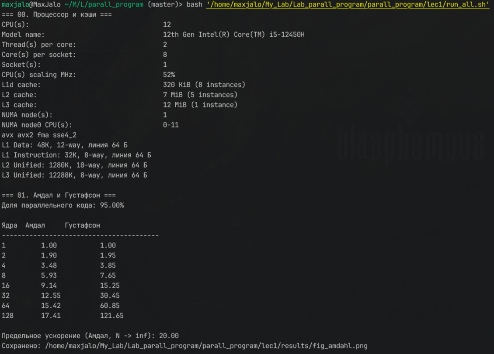
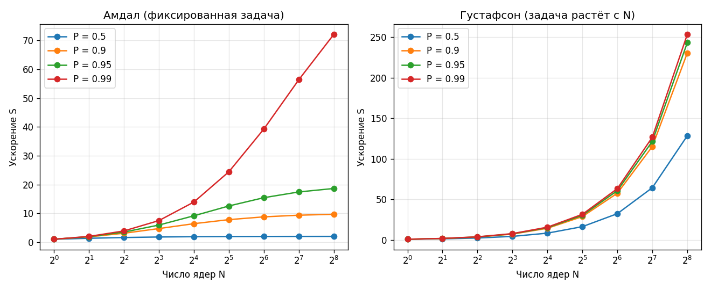
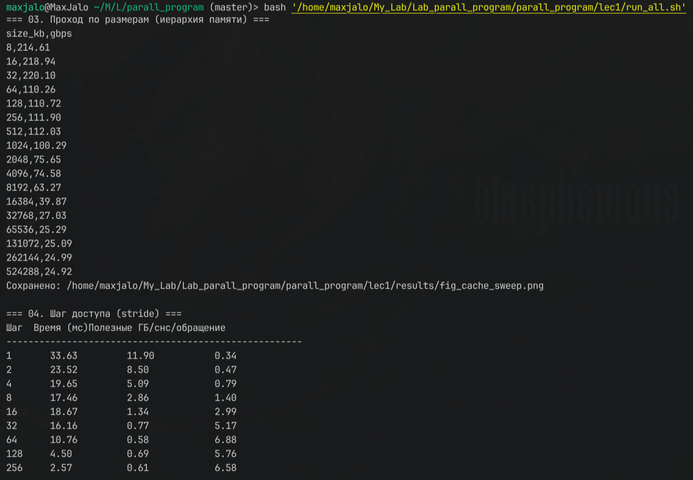
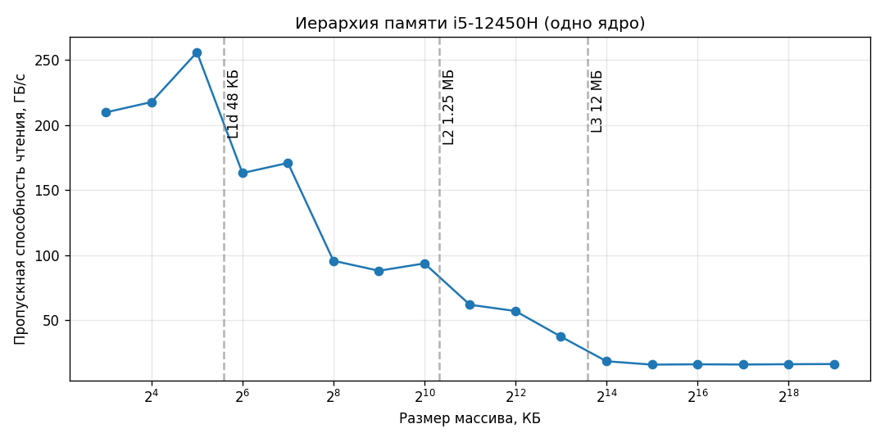
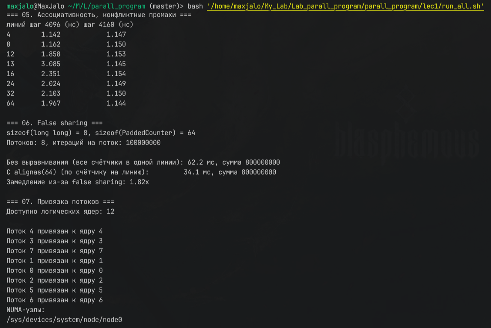
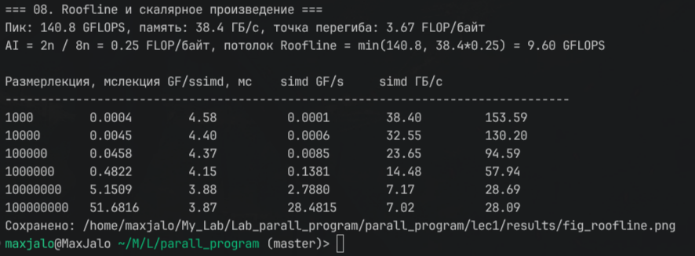
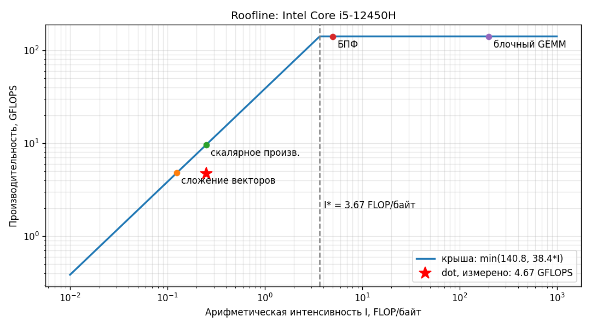

# Лекция 1. Архитектура высокопроизводительных вычислительных систем и основы параллелизма

Конспект по [lec01.pdf](lec01.pdf). Формат каждой темы: краткая теория, проверочный код, результат на моей машине, место под скриншот.

**Как запускать.** Все примеры собираются и запускаются одной командой:

```bash
cd lec1 && bash run_all.sh
```

Исходники лежат в `code/`, бинарники в `bin/` (не в git), графики и сырые данные в `results/`.

**Машина.** Intel Core i5-12450H (Alder Lake: 4 P-ядра + 4 E-ядра, 12 потоков), 1 × 16 ГБ DDR5-4800, Ubuntu 24.04 в WSL2, g++ 13.3. На момент прогона виртуальная машина WSL видела **4 логических CPU**: их число задаётся в `%UserProfile%\.wslconfig` (`processors=`), и это ограничивает многопоточные примеры.

---

## 1. Введение: мотивация, классификация Флинна, законы Амдала и Густафсона

### 1.1. Актуальность: три «стены»

**Теория.** С 1970 по 2005 год производительность росла в основном за счёт частоты: от 1 МГц до 4 ГГц. Дальше рост упёрся в **стену частоты** и **стену питания**: тепловыделение, токи утечки и скорость распространения сигнала. С 2005 года растёт число ядер — от 2 (Core Duo, 2006) до 128+ (EPYC Genoa, 2023), — и появляются гетерогенные системы (CPU + GPU/TPU). Последовательная программа на современном процессоре теряет **90–99 %** доступной мощности.

Третья стена — **стена памяти** (Wulf & McKee, 1995): процессоры ускоряются быстрее, чем память. Разрыв между пиковыми FLOPS и пропускной способностью памяти достигает **100–200×** для FP32.

**Проверка.** Раздел `00` в `run_all.sh` печатает модель процессора, число ядер и кэши:

```bash
lscpu | grep -E "Model name|^CPU\(s\)|Thread|Core|Socket|L1d|L2|L3|NUMA"
```



*img_1 — вывод раздела «00. Процессор и кэши»: lscpu и геометрия кэшей из /sys*

### 1.2. Классификация Флинна (1966)

**Теория.** Архитектуры делятся по числу потоков **команд** (Instruction) и **данных** (Data):

| Класс | Команды | Данные | Пример |
|---|---|---|---|
| SISD | 1 | 1 | классический последовательный CPU |
| SIMD | 1 | много | SSE/AVX/NEON, GPU |
| MISD | много | 1 | практически не используется |
| MIMD | много | много | многоядерные CPU, кластеры |

В курсе важны два класса. **SIMD** — векторизация внутри одного ядра: AVX2 обрабатывает 8 float за инструкцию, AVX-512 — 16. **MIMD** — многопоточность на SMP-системе.

**Проверка.** Флаги SIMD процессора:

```bash
lscpu | grep -o -w -E "sse4_2|avx|avx2|fma|avx512f" | sort -u
```

**Результат:** `avx avx2 fma sse4_2`. **AVX-512 нет** — на потребительских Alder Lake он отключён, поэтому максимум для этой машины — 256-битные регистры `ymm`, 8 float за инструкцию. Скриншот — на img_1.

### 1.3–1.5. Законы Амдала и Густафсона

**Теория.** **Закон Амдала (1967)** — ускорение задачи *фиксированного* размера на \(N\) ядрах, где \(P\) — доля кода, которую можно распараллелить:

\[ S = \frac{1}{(1-P) + P/N}, \qquad S_{max} = \lim_{N\to\infty} S = \frac{1}{1-P} \]

Последовательная часть \((1-P)\) ставит жёсткий потолок: при \(P = 0.9\) ускорение не превысит 10, при \(P = 0.99\) — 100, сколько ядер ни добавляй.

**Закон Густафсона (1988)** — задача *растёт* вместе с числом ядер, а время остаётся постоянным. Здесь \(p = 1-P\) — доля последовательного кода:

\[ S = N - p(N-1) = 1 + P(N-1) \]

Густафсон оптимистичнее: если на большем кластере решать задачу большего размера, последовательная часть перестаёт доминировать.

**Пример из лекции.** Обработка снимка 10000×10000: 5 % последовательной работы, 95 % параллельной, \(N = 16\):
- Амдал: \(S = 1/(0.05 + 0.95/16) = 1/0.109 \approx 9.17\);
- Густафсон: \(S = 16 - 0.05 \cdot 15 = 15.25\).

**Проверка.** `code/01_amdahl.cpp` (фрагмент 1 лекции):

```cpp
double amdahls_law(double P, int N) {
    return 1.0 / ((1.0 - P) + P / static_cast<double>(N));
}
double gustafsons_law(double P, int N) {
    double p = 1.0 - P;          // доля последовательного кода
    return N - p * (N - 1);
}
```

```bash
g++ -O2 code/01_amdahl.cpp -o bin/01_amdahl && ./bin/01_amdahl
python3 code/02_amdahl_plot.py      # график -> results/fig_amdahl.png
```

**Результат:**

| Ядра | 1 | 2 | 4 | 8 | 16 | 32 | 64 | 128 |
|---|---|---|---|---|---|---|---|---|
| Амдал | 1.00 | 1.90 | 3.48 | 5.93 | **9.14** | 12.55 | 15.42 | 17.41 |
| Густафсон | 1.00 | 1.95 | 3.85 | 7.65 | **15.25** | 30.45 | 60.85 | 121.65 |

Предел по Амдалу при \(N \to \infty\): 20.00. Значение 9.14 вместо 9.17 из лекции — лекция округлила знаменатель до 0.109, точное значение 0.109375.

**Вывод.** По Амдалу 128 ядер дают всего 17.4× — это 14 % эффективности. По Густафсону — 121.65×, потому что вместе с ядрами растёт и объём задачи.





*img_2 — вывод bin/01_amdahl (таблица ускорений)*

---

## 2. Иерархия памяти: регистры, L1/L2/L3, RAM

### 2.1. Общая структура

**Теория.** Иерархия памяти минимизирует среднее время доступа и опирается на **локальность**:
- **временную** — к недавно использованным данным скоро обратятся снова;
- **пространственную** — скоро обратятся к соседним адресам.

Типичные значения (Sapphire Rapids / EPYC Genoa, по Hennessy & Patterson):

| Уровень | Объём | Задержка, такты | Задержка, нс | Пропускная способность |
|---|---|---|---|---|
| Регистры | ~1 КБ | 1 | ~0.3 | ~1000+ ГБ/с |
| L1d | 32–64 КБ | 4–5 | ~1.5 | ~100 ГБ/с |
| L2 | 256 КБ – 1.25 МБ | 12–14 | ~4–5 | ~50 ГБ/с |
| L3 | 8–64 МБ | 40–50 | ~12–15 | ~30 ГБ/с |
| DDR5 | 16–512 ГБ | 200–300 | ~60–100 | ~50–100 ГБ/с |
| NVMe SSD | 1–8 ТБ | ~100 000 | ~10 000 | ~7 ГБ/с |

Кэши моей машины (из `/sys/devices/system/cpu/cpu0/cache/`): L1d 48 КБ, 12-way; L2 1.25 МБ, 10-way; L3 12 МБ, 8-way, общий на все ядра; линия 64 байта.

**Проверка.** `code/03_cache_sweep.cpp` читает массив растущего размера (от 8 КБ до 512 МБ) и считает пропускную способность. Пока массив помещается в кэш, данные берутся оттуда; как только перестаёт — скорость падает до следующего уровня.

```cpp
// 32 независимых накопителя = 4 ymm-регистра, чтобы упираться в память, а не в задержку сложения
float acc[32] = {};
for (size_t i = 0; i < n; i += 32)
    for (int j = 0; j < 32; ++j) acc[j] += a[i + j];
```

```bash
g++ -O3 -march=native -ffast-math code/03_cache_sweep.cpp -o bin/03_cache_sweep
taskset -c 2 ./bin/03_cache_sweep | tee results/cache_sweep.csv
python3 code/03_cache_plot.py
```

**Результат** (одно ядро):

| Где лежат данные | Размер массива | Чтение, ГБ/с |
|---|---|---|
| L1d | 8–32 КБ | 210–256 |
| L2 | 64 КБ – 1 МБ | 88–171 |
| L3 | 2–8 МБ | 38–62 |
| RAM | ≥ 32 МБ | **~16** |



**Вывод.** Между L1 и RAM разница **~15 раз** — это и есть стена памяти, измеренная на моей машине. Одно ядро выжимает из памяти ~16 ГБ/с — примерно 42 % от теоретических 38.4 ГБ/с: для насыщения шины нужны несколько ядер. Если убрать 32 независимых накопителя и оставить один, граница L1/L2 пропадает: цикл упирается в задержку `vaddps` (4 такта), а не в кэш.



*img_3 — вывод bin/03_cache_sweep (CSV size_kb, gbps)*

### 2.2. Кэш-линии

**Теория.** Память читается не побайтово, а **кэш-линиями** — блоками по 64 байта на x86-64 и ARM. Обращение к одному байту загружает всю линию. Отсюда пространственная локальность: после `A[i]` элементы `A[i+1]..A[i+15]` (для float) уже в кэше. **Аппаратный предвыборщик** (prefetcher) замечает последовательный доступ и подгружает следующие линии заранее.

**Проверка.** Размер линии: `cat /sys/devices/system/cpu/cpu0/cache/index0/coherency_line_size` → `64` (img_1). Практическое следствие — в разделе 2.4.

### 2.3. Типы промахов (классификация 3C)

**Теория.**
1. **Compulsory** (обязательный) — первое обращение: данных в кэше ещё не было.
2. **Capacity** (по ёмкости) — данные вытеснены, потому что рабочее множество больше кэша. Это ступеньки на графике из 2.1.
3. **Conflict** (конфликтный) — данные вытеснены из-за ограниченной ассоциативности: несколько адресов претендуют на один набор. Демонстрация — в разделе 2.5.

### 2.4. Влияние шага доступа (stride)

**Теория.** При шаге 1 предвыборщик работает идеально, и каждая загруженная линия используется полностью. При шаге больше 64 байт каждое обращение — это новая линия, то есть промах, и из привезённых 64 байт используется только 4. Лекция обещает разницу в **50–100 раз**.

**Проверка.** `code/04_stride.cpp` (фрагмент 2). Массив из 100 млн `int` (400 МБ) обходится с шагом от 1 до 256:

```cpp
long long traverse_with_stride(const std::vector<int>& data, int stride) {
    long long sum = 0;
    for (size_t i = 0; i < data.size(); i += stride) sum += data[i];
    return sum;
}
```

```bash
g++ -O2 code/04_stride.cpp -o bin/04_stride && taskset -c 2 ./bin/04_stride
```

**Результат:**

| Шаг (int) | Шаг (байт) | Время, мс | нс на обращение | Полезные ГБ/с |
|---|---|---|---|---|
| 1 | 4 | 42.8 | 0.43 | 9.34 |
| 4 | 16 | 28.4 | 1.13 | 3.53 |
| 16 | 64 | 22.9 | 3.66 | 1.09 |
| 64 | 256 | 15.4 | 9.86 | 0.41 |
| 256 | 1024 | 3.5 | 9.00 | 0.44 |

**Вывод.** Стоимость одного обращения выросла с 0.43 до ~9.9 нс — в **23 раза**. Это меньше «50–100×» из лекции: предвыборщик Alder Lake распознаёт и шаговые паттерны. При шаге 16 обращений в 16 раз меньше, а работает программа быстрее всего в 1.9 раза: из памяти всё равно тянутся все 6.25 млн линий, только из каждой используется один `int` из шестнадцати.



*img_4 — вывод bin/04_stride*

### 2.5. Ассоциативность кэша

**Теория.** Кэш делится на **наборы** (sets), в каждом — несколько **путей** (ways). Адрес однозначно определяет набор, а внутри набора линия может лечь в любой путь.
- **1-way (прямое отображение):** быстро, но много конфликтных промахов.
- **Полностью ассоциативный:** конфликтов нет, но дорого и медленно.
- **Множественно-ассоциативный (4-, 8-, 12-way):** компромисс.

Для моей L1d: \(48\,\text{КБ} / (12 \cdot 64\,\text{Б}) = 64\) набора. Номер набора — это биты адреса 6–11, поэтому адреса с шагом \(64 \cdot 64 = 4096\) байт попадают **в один и тот же набор**. Больше 12 таких линий в L1 не поместятся, хотя это всего несколько килобайт.

**Проверка.** `code/05_assoc.cpp` строит кольцо из \(K\) линий и ходит по нему «погоней за указателями»: каждая загрузка ждёт предыдущую, поэтому время шага равно задержке уровня кэша, где лежит линия.

```cpp
for (long long s = 0; s < steps; ++s) {
    p = *reinterpret_cast<char**>(p);
    asm volatile("" : "+r"(p));   // запрет выкидывать цепочку загрузок
}
```

```bash
g++ -O2 code/05_assoc.cpp -o bin/05_assoc && taskset -c 2 ./bin/05_assoc
```

**Результат:**

| Линий K | Шаг 4096 Б, нс | Шаг 4160 Б, нс |
|---|---|---|
| 4 | 1.26 | 1.25 |
| 8 | 1.26 | 1.25 |
| 12 | 1.55 | 1.25 |
| **13** | **3.54** | 1.26 |
| 16 | 2.87 | 1.28 |
| 64 | 2.38 | 1.25 |

**Вывод.** До 12 линий обе серии держатся на ~1.26 нс — это задержка L1 (~5 тактов). На **13-й линии** — ровно после 12 путей — серия с шагом 4096 прыгает до ~3 нс: это задержка L2. При шаге 4160 те же 64 линии раскладываются по разным наборам и остаются в L1. Это чистый конфликтный промах: 13 линий по 64 байта — всего 832 байта при кэше в 48 КБ.


*img_5 — вывод bin/05_assoc*

---

## 3. Когерентность кэшей: протокол MESI и ложное совместное использование

### 3.1. Проблема когерентности

**Теория.** У каждого ядра свои L1 и L2. Если ядро 0 записало `x` в свой кэш, а ядро 1 читает `x` из своего, без специального протокола оно увидит устаревшее значение. **Когерентность** гарантирует, что все ядра видят согласованное значение каждой линии.

### 3.2. Протокол MESI

**Теория.** У каждой кэш-линии одно из четырёх состояний (Papamarcos & Patel, 1984):

| Состояние | Смысл | Совпадает с RAM? | Где есть копии |
|---|---|---|---|
| **M**odified | линия изменена | нет | только в этом кэше |
| **E**xclusive | не изменена | да | только в этом кэше |
| **S**hared | не изменена | да | в нескольких кэшах |
| **I**nvalid | недействительна | — | нужно перечитать |

Основные переходы:

| Событие | Из | В |
|---|---|---|
| чтение, данных нет у других | I | E |
| чтение, данные есть у других | I | S |
| запись своим ядром | E | M |
| запись своим ядром | S | M, у остальных — I (инвалидация) |
| чтение другим ядром | E / M | S (M сначала сбрасывается в память) |
| запись другим ядром | M / E / S | I |

Главное следствие: **запись в линию, которая есть у других ядер, стоит дорого** — нужно разослать инвалидацию, а следующему читателю придётся забирать линию по шине между ядрами.

**Проверка.** Из пользовательской программы состояния MESI не увидеть — их видно только косвенно, по цене. Как раз это показывает следующий раздел.

### 3.3. Ложное совместное использование (false sharing)

**Теория.** Потоки на разных ядрах пишут в **разные** переменные, но эти переменные лежат в **одной** кэш-линии. По MESI каждая запись инвалидирует линию у остальных, и линия «пинг-понгом» летает между ядрами, хотя логически данные не общие. Лекция даёт замедление **10–100×**. Лечится выравниванием `alignas(64)`, дополнением до размера линии (padding) и переходом от массива структур к структуре массивов (SoA вместо AoS) (Boyd-Wickizer et al., 2010).

**Проверка.** `code/06_false_sharing.cpp` объединяет фрагменты 3 и 4. Каждый поток 100 млн раз увеличивает свой счётчик: в первом варианте счётчики — соседние `long long` в одной линии, во втором — `struct alignas(64) PaddedCounter`, по одной линии на счётчик.

```cpp
struct alignas(64) PaddedCounter { long long value = 0; };   // sizeof == 64

volatile long long& c = get(counters[t]);
for (int i = 0; i < iters; ++i) c = c + 1;
```

Отличие от лекции — `volatile`. Без него `g++ -O2` держит счётчик в регистре и пишет в память один раз после цикла, и false sharing просто исчезает: сравнивать становится нечего.

```bash
g++ -O2 -pthread code/06_false_sharing.cpp -o bin/06_false_sharing && ./bin/06_false_sharing
```

**Результат** (4 потока на 4 vCPU WSL):

| Вариант | Время, мс |
|---|---|
| Все счётчики в одной линии | 45.5 |
| `alignas(64)`, счётчик на линию | 32.2 |
| **Замедление** | **1.42×** |

**Вывод.** Эффект есть, но он намного слабее обещанных 10–100×. Причины — среда: 4 виртуальных CPU под Hyper-V могут оказаться гиперпотоками одного физического ядра, а у них L1 и L2 общие, пинг-понгу там негде случиться. На «голом» Linux с потоками, привязанными к разным физическим ядрам, разница будет кратной. Счётчики `perf stat -e cache-misses`, которые предлагает лекция, в WSL2 недоступны: Hyper-V не пробрасывает PMU процессора.


*img_6 — вывод bin/06_false_sharing*

---

## 4. NUMA-архитектуры

### 4.1–4.2. Принцип и цена удалённого доступа

**Теория.** **NUMA** (Non-Uniform Memory Access) — у каждого сокета своя локальная память, а доступ к памяти чужого сокета медленнее. На Xeon и EPYC NUMA-домены бывают даже внутри одного сокета (чиплеты со своими контроллерами). Типичная двухсокетная система:

| Доступ | Задержка | Пропускная способность |
|---|---|---|
| Локальный | ~80 нс | ~50 ГБ/с |
| Удалённый, 1 переход | ~140 нс | ~30 ГБ/с |
| Удалённый, 2 перехода | ~200 нс | ~20 ГБ/с |

Разница в задержке — **1.5–3×**.

### 4.3. Привязка потоков (thread affinity)

**Теория.** Поток нужно держать на ядрах одного NUMA-домена, а его данные — в памяти того же домена. В Linux для этого есть `pthread_setaffinity_np`, `sched_setaffinity` и `taskset`, для памяти — `numactl`, `mbind` и `set_mempolicy`. В Windows — `SetThreadAffinityMask`.

**Проверка.** `code/07_affinity.cpp` (фрагмент 5):

```cpp
cpu_set_t cpuset;
CPU_ZERO(&cpuset);
CPU_SET(core_id, &cpuset);
pthread_setaffinity_np(pthread_self(), sizeof(cpu_set_t), &cpuset);
int current_core = sched_getcpu();      // проверка: где реально выполняется поток
```

```bash
g++ -O2 -pthread code/07_affinity.cpp -o bin/07_affinity && ./bin/07_affinity
ls -d /sys/devices/system/node/node*     # NUMA-узлы
```

**Результат.** Потоки 0–3 привязаны к ядрам 0–3, и `sched_getcpu()` это подтверждает (порядок строк в выводе случайный — потоки печатают параллельно). В системе один NUMA-узел `node0`: односокетный ноутбук, да ещё и за гипервизором. Цены удалённого доступа здесь не измерить, это тема для двухсокетного сервера.


*img_7 — вывод bin/07_affinity и список NUMA-узлов*

### 4.4. Практические рекомендации

- `numactl --hardware` показывает NUMA-топологию (нужен пакет `numactl`).
- **First-touch**: страница памяти физически выделяется в домене того потока, который **первым в неё записал**. Инициализировать данные надо тем же потоком, который потом с ними работает.
- Не допускать миграции потоков между доменами: привязка или `taskset`.

---

## 5. Roofline-модель

### 5.1–5.2. Идея и формулы

**Теория.** Roofline (Williams, Waterman, Patterson, 2009) даёт потолок производительности алгоритма на конкретной машине. Алгоритм ограничен либо пиковой вычислительной мощностью \(\pi\), либо пропускной способностью памяти \(\beta\) — в зависимости от **арифметической интенсивности**:

\[ I = \frac{\text{FLOPs}}{\text{Bytes}}, \qquad P = \min(\pi,\ \beta \cdot I), \qquad I^* = \frac{\pi}{\beta} \]

При \(I < I^*\) алгоритм **memory-bound**, при \(I > I^*\) — **compute-bound**.

### 5.3. Построение для CPU

**Теория.** Пример из лекции: i9-13900K, \(\pi \approx 200\) GFLOPS на одно ядро с AVX2+FMA, \(\beta \approx 90\) ГБ/с (2 × DDR5-5600), \(I^* \approx 2.2\).

**Расчёт для моей машины:**
- \(\pi = 2\ \text{FMA-порта} \times 8\ \text{float} \times 2\ \text{FLOP} \times 4.4\ \text{ГГц} = 140.8\) GFLOPS (одно P-ядро, float);
- \(\beta = 4800 \cdot 10^6 \times 8\ \text{байт} \times 1\ \text{модуль} = 38.4\) ГБ/с;
- \(I^* = 140.8 / 38.4 \approx 3.67\) FLOP/байт.

Точка перегиба у меня правее, чем в лекции: памяти меньше (один модуль вместо двух), поэтому memory-bound алгоритмы проигрывают ещё сильнее.

### 5.4. Построение для GPU

**Теория.** RTX 4090: \(\pi \approx 83\) TFLOPS FP32, \(\beta \approx 1008\) ГБ/с, \(I^* \approx 82\) FLOP/байт. GPU нужна гораздо более высокая интенсивность, чтобы выйти на пик. Проверить негде — GPU в WSL здесь не используется.

### 5.5. Использование модели

| Алгоритм | AI, FLOP/байт | Ограничение |
|---|---|---|
| Скалярное произведение | ~0.25 | memory-bound |
| Сложение векторов | ~0.125 | memory-bound |
| Блочное умножение матриц | ~100–500 | compute-bound |
| БПФ | ~5 | переходная зона |



---

## 6. Практический кейс: скалярное произведение

### 6.1. Анализ через Roofline

**Теория.** Для \(a \cdot b = \sum a_i b_i\) при float: \(2n\) FLOP на \(8n\) байт, значит \(I = 0.25\) FLOP/байт. Это намного меньше \(I^* = 3.67\): задача жёстко memory-bound, потолок — \(\min(140.8,\ 38.4 \cdot 0.25) = 9.6\) GFLOPS. FMA здесь почти не помогает — узкое место в подаче данных.

**Проверка.** `code/08_roofline_dot.cpp` — фрагмент 6 с параметрами моей машины. Я добавил второй вариант для сравнения:

```cpp
// лекция: накопление в double — цепочка зависимых сложений, не векторизуется
double sum = 0.0;
for (size_t i = 0; i < a.size(); ++i) sum += static_cast<double>(a[i]) * b[i];

// добавлено: omp simd разрешает векторизовать редукцию без -ffast-math
#pragma omp simd reduction(+ : sum)
for (size_t i = 0; i < n; ++i) sum += pa[i] * pb[i];
```

```bash
g++ -O3 -march=native -fopenmp-simd code/08_roofline_dot.cpp -o bin/08_roofline_dot
taskset -c 2 ./bin/08_roofline_dot
python3 code/09_roofline_plot.py 4.67
```

**Результат** (медиана из 7 прогонов):

| n | Где данные | Лекция, GFLOPS | `omp simd`, GFLOPS | `omp simd`, ГБ/с |
|---|---|---|---|---|
| 10³ | L1 | 3.84 | **36.71** | 146.8 |
| 10⁴ | L1/L2 | 3.55 | 27.26 | 109.0 |
| 10⁵ | L2 | 4.02 | 22.94 | 91.8 |
| 10⁶ | L3 | 3.49 | 11.22 | 44.9 |
| 10⁷ | RAM | 2.66 | 4.49 | 18.0 |
| 10⁸ | RAM | 2.96 | **4.67** | 18.7 |

**Вывод.**
1. Вариант из лекции выдаёт ~3–4 GFLOPS **при любом размере**, даже в L1. Значит, он упирается не в память, а в собственную цепочку зависимых сложений в `double`: каждое сложение ждёт предыдущее. До крыши Roofline он не дотягивает вообще.
2. Векторизованный вариант в L1 даёт 36.7 GFLOPS — в 10 раз больше. На данных из RAM он падает до 4.67 GFLOPS при 18.7 ГБ/с, то есть упирается ровно в ту пропускную способность одного ядра, которую показал раздел 2.1 (~16–19 ГБ/с).
3. Реальный потолок одного ядра — \(18.7 \cdot 0.25 \approx 4.7\) GFLOPS, это 49 % от теоретических 9.6. Остальное — недоиспользованная шина: одно ядро не насыщает контроллер памяти.


*img_8 — вывод bin/08_roofline_dot*

### 6.2. Демонстрация false sharing

Разобрана в разделе 3.3 (программа `06_false_sharing`).

---

## Заключение

1. Производительность растёт за счёт числа ядер, а не частоты, поэтому параллелизм обязателен.
2. Амдал ограничивает ускорение задачи фиксированного размера, Густафсон описывает рост задачи вместе с числом ядер.
3. Иерархия памяти: регистры → L1 → L2 → L3 → RAM. На моей машине чтение из L1 и из RAM различается в ~15 раз.
4. MESI обеспечивает когерентность, а его цена проявляется как false sharing.
5. В NUMA-системах потоки и данные надо держать в одном домене.
6. Roofline говорит, что оптимизировать — вычисления или доступ к памяти.

## Контрольные вопросы

1. **Почему скалярное произведение memory-bound?** \(I = 0.25\) FLOP/байт — намного ниже точки перегиба (3.67 у меня, 2.2 в лекции): процессор простаивает в ожидании данных.
2. **Как размер кэш-линии влияет на false sharing?** Когерентность работает на уровне линии. Все переменные внутри одних 64 байт конфликтуют между собой, даже если логически независимы. Чем больше линия, тем больше переменных туда попадает.
3. **Почему Густафсон оптимистичнее Амдала?** Он предполагает, что вместе с числом ядер растёт объём задачи, и доля последовательной части в общем времени падает. Амдал держит размер задачи фиксированным.
4. **Зачем thread affinity в NUMA?** Чтобы поток не мигрировал на ядро другого домена и не обращался к удалённой памяти, которая в 1.5–3 раза медленнее. Плюс сохраняются «прогретые» L1 и L2.
5. **Почему шаг 256 медленнее шага 1?** Каждое обращение попадает в новую кэш-линию: промах, из 64 привезённых байт используется только 4, а предвыборщик справляется хуже. У меня стоимость обращения выросла в 23 раза.
6. **Состояния MESI и переходы при записи.** Запись своим ядром переводит линию в M; если линия была в S, остальные копии инвалидируются (→ I). Запись другим ядром переводит нашу копию в I.
7. **Что такое AI и как по ней найти место на Roofline?** \(I = \text{FLOP}/\text{байт}\). Если \(I < \pi/\beta\) — задача на наклонной части крыши (memory-bound), если больше — на горизонтальной (compute-bound).
8. **Почему у блочного GEMM интенсивность выше, чем у скалярного произведения?** В блоке, который помещается в кэш, каждый загруженный элемент участвует в \(O(B)\) операциях, а не в одной. Интенсивность растёт пропорционально размеру блока.

---

## Список скриншотов

| Файл | Что снять |
|---|---|
| `results/img_1.png` | раздел «00. Процессор и кэши» из `run_all.sh` |
| `results/img_2.png` | вывод `bin/01_amdahl` |
| `results/img_3.png` | вывод `bin/03_cache_sweep` |
| `results/img_4.png` | вывод `bin/04_stride` |
| `results/img_5.png` | вывод `bin/05_assoc` |
| `results/img_6.png` | вывод `bin/06_false_sharing` |
| `results/img_7.png` | вывод `bin/07_affinity` и NUMA-узлы |
| `results/img_8.png` | вывод `bin/08_roofline_dot` |

Графики `fig_amdahl.png`, `fig_cache_sweep.png` и `fig_roofline.png` генерируются автоматически при запуске `run_all.sh`.
