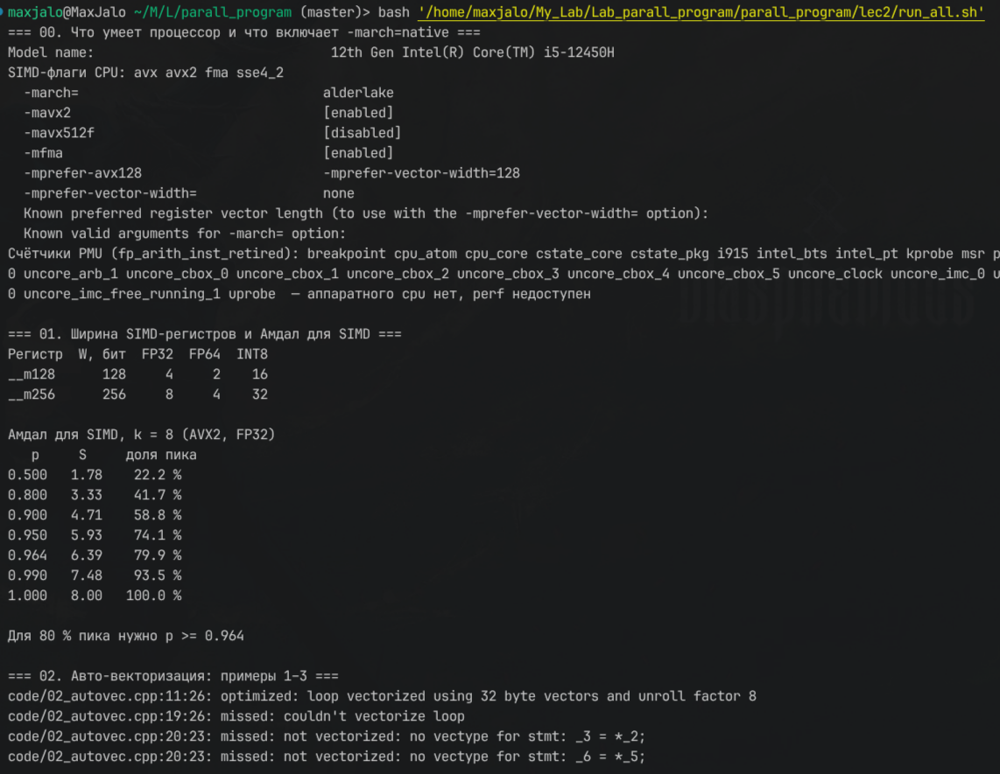
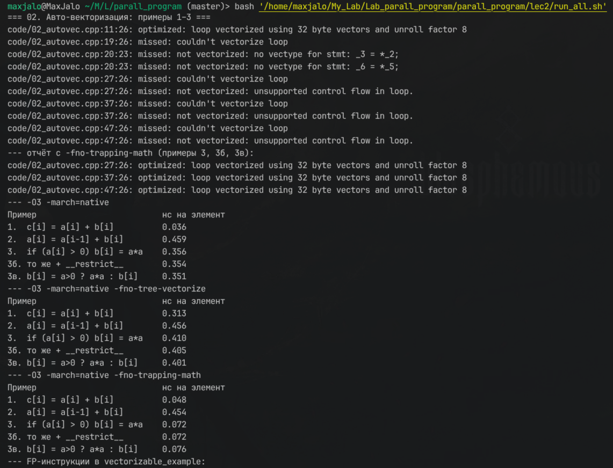
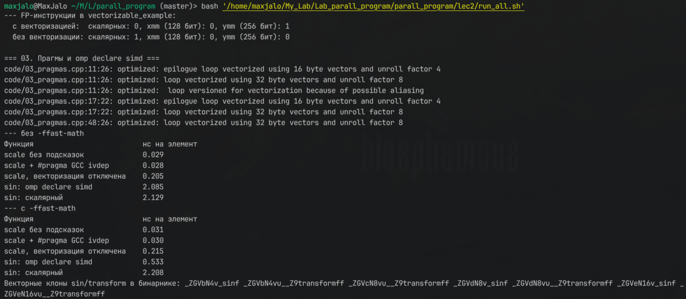
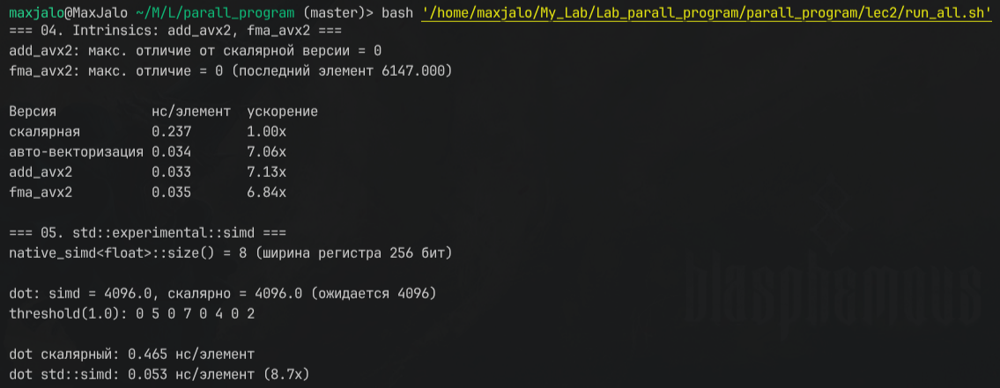
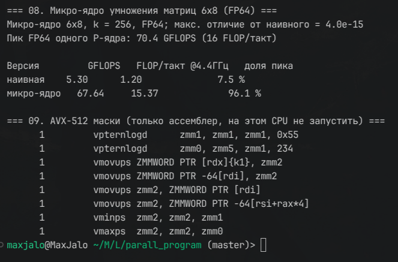
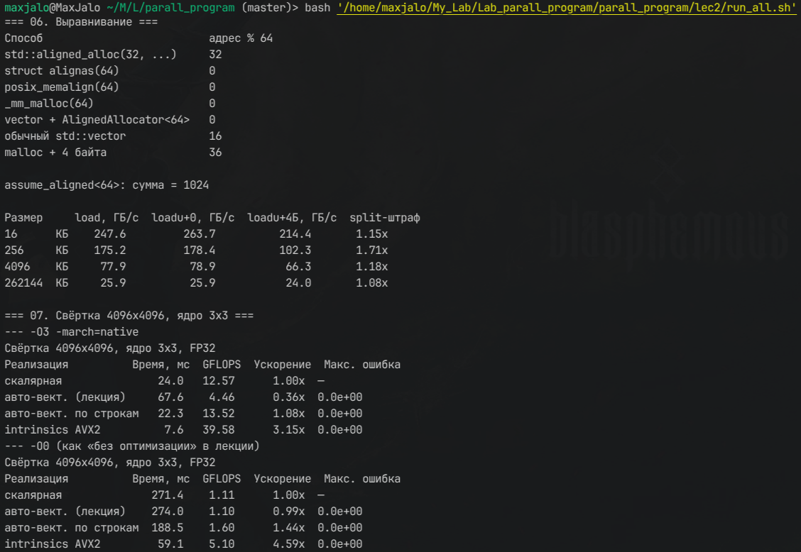

# Лекция 2. Векторизация вычислений: SIMD, авто-векторизация, intrinsics

Конспект по [lec02.pdf](lec02.pdf). Формат каждой темы: краткая теория, проверочный код, результат на моей машине, место под скриншот.

**Как запускать:**

```bash
cd lec2 && bash run_all.sh | tee results/run_all.log
```

Исходники лежат в `code/`, общая утилита замеров — `code/bench.h`: медиана из 7 прогонов плюс `keep()`, чтобы компилятор не выкинул результат. Бинарники кладутся в `bin/`, логи и отчёты компилятора — в `results/`.

**Машина:** i5-12450H (Alder Lake), g++ 13.3, WSL2. Все замеры выполнены на одном ядре (`taskset -c 2`).

---

## 1. Введение

### 1.1–1.2. Кризис частот и роль векторизации

**Теория.** Когда рост частоты остановился, производительность стали наращивать двумя путями: больше ядер (MIMD, лекция 1) и шире векторные регистры (SIMD). SIMD — самый энергоэффективный вид параллелизма: одна инструкция декодируется один раз, а работает над 8–16 числами. Код без векторизации теряет до 8× (AVX2) или 16× (AVX-512) производительности **на каждом ядре**.

### 1.3. Цели лекции

Разобраться в архитектуре SIMD; понимать, когда компилятор векторизует сам; управлять этим прагмами; писать intrinsics; учитывать выравнивание; читать отчёты компилятора и профилировщика.

**Проверка.** Какие SIMD-расширения есть у процессора и что включает флаг `-march=native`:

```bash
grep -o -w -E 'sse4_2|avx|avx2|fma|avx512f' /proc/cpuinfo | sort -u
g++ -march=native -Q --help=target | grep -E -- "-march=|-mavx2 |-mfma |-mavx512f "
```

**Результат:** флаги `avx avx2 fma sse4_2`; `-march=alderlake`, `-mavx2 [enabled]`, `-mfma [enabled]`, `-mavx512f [disabled]`. Значит, максимум на этой машине — 256-битные `ymm`, AVX-512 нет.



*img_1 — разделы «00» (флаги процессора, вывод -Q --help=target, список PMU) и «01» из run_all.sh*

---

## 2. Концепция параллелизма уровня данных (DLP)

### 2.1. Место SIMD в таксономии Флинна

**Теория.** Одна инструкция применяется ко многим данным. В отличие от MIMD, не нужны ни потоки, ни синхронизация: параллелизм прячется внутри одной инструкции.

### 2.2. Формальная модель: $k = W / w$

**Теория.** Регистр шириной $W$ бит вмещает $k = W/w$ элементов по $w$ бит:

| Архитектура | $W$, бит | FP32 | FP64 | INT8 |
|---|---|---|---|---|
| SSE | 128 | 4 | 2 | 16 |
| AVX2 | 256 | 8 | 4 | 32 |
| AVX-512 | 512 | 16 | 8 | 64 |
| ARM NEON | 128 | 4 | 2 | 16 |
| ARM SVE/SVE2 | 128–2048 | масштабируемо | | |

### 2.3. Закон Амдала для SIMD

**Теория.** Если векторизуется доля $p$ кода при ширине вектора $k$:

$$
S = \frac{1}{(1-p) + p/k}
$$

**Проверка.** `code/01_simd_width.cpp` берёт $k$ из `sizeof(__m256)` и считает ускорение $S$ для разных $p$:

```cpp
double amdahl_simd(double p, int k) { return 1.0 / ((1.0 - p) + p / k); }
std::printf("__m256 %zu бит, FP32: %zu\n", sizeof(__m256) * 8, sizeof(__m256) / 4);
```

```bash
g++ -std=c++20 -O2 code/01_simd_width.cpp -o bin/01_simd_width && ./bin/01_simd_width
```

**Результат** ($k = 8$):

| $p$ | 0.50 | 0.80 | 0.90 | 0.95 | 0.964 | 0.99 |
|---|---|---|---|---|---|---|
| $S$ | 1.78 | 3.33 | 4.71 | 5.93 | 6.39 | 7.48 |
| доля пика | 22 % | 42 % | 59 % | 74 % | **80 %** | 94 % |

**Вывод.** В лекции сказано, что для 80 % пика достаточно $p \ge 0.95$. Точный расчёт даёт **$p \ge 0.964$**: при $p = 0.95$ получается только 74 %. Смысл тот же: даже 5 % невекторизованного кода съедают четверть ускорения.

*Вывод bin/01_simd_width — нижняя часть img_1.*

---

## 3. Архитектура векторных расширений

### 3.1. Эволюция x86 SIMD

**Теория.**
- **MMX** (1997) — 64-битные регистры, только целые.
- **SSE** (1999) — 128-битные `xmm`, FP32.
- **SSE2** (2001) — добавлены FP64 и целые на 128 битах.
- **SSE3/4.x** (2004–2008) — горизонтальные операции, `dpps`, строковые инструкции.
- **AVX** (2011) — 256-битные `ymm` и трёхоперандная форма VEX (`vaddps ymm0, ymm1, ymm2` не портит источник).
- **AVX2** (2013) — целые на 256 битах, gather.
- **AVX-512** (2016+) — 512-битные `zmm`, регистры масок `k0–k7`, scatter.
- **AMX** (2023+) — тайловые регистры по 1 КБ для умножения матриц в INT8/BF16.

По ассемблеру видно, что использует код: `xmm` — SSE или 128-битный AVX, `ymm` — AVX/AVX2, `zmm` — AVX-512. Суффикс `ss`/`sd` означает одно число (scalar single/double), `ps`/`pd` — упакованный вектор (packed).

### 3.2. ARM SVE

**Теория.** Длина вектора не зашита в ISA: реализация выбирает её от 128 до 2048 бит с шагом 128. Один и тот же бинарник работает на процессорах с разной шириной SIMD (Vector Length Agnostic). Условное выполнение делается через предикатные регистры, есть gather/scatter с предикатом. Похожий подход у RISC-V RVV.

### 3.3. Структура векторного ALU

**Теория.** Векторные инструкции исполняются на разных портах. Пример Skylake-X: порт 0 — FMA, деление, 512-битные операции; порт 1 — FMA, умножение; порт 5 — перестановки (shuffle); порты 2, 3 и 7 — загрузки и адреса. **Два FMA-порта** — отсюда пик $2 \times k \times 2$ FLOP за такт. Для меня это $2 \cdot 8 \cdot 2 = 32$ FLOP/такт FP32 и 16 FLOP/такт FP64. Проверка пика на практике — раздел 9.

---

## 4. Автоматическая векторизация компилятором

### 4.1. Условия авто-векторизации

**Теория.** Компилятор векторизует цикл, если выполнены условия:
1. **Число итераций известно** до входа в цикл.
2. **Нет зависимостей между итерациями** — ни RAW, ни WAR, ни WAW. Рекуррентность `a[i] = a[i-1] + b[i]` не векторизуется.
3. **Индексы линейны** по счётчику цикла.
4. **Нет побочных эффектов**: вызов функции блокирует векторизацию, если функция не помечена `omp declare simd`.
5. Желательно выровненная память.

Флаги GCC: векторизатор включается на `-O2` с дешёвой моделью стоимости и на `-O3` полностью; `-march=native` разрешает AVX2; отчёт выдают `-fopt-info-vec`, `-fopt-info-vec-missed` и `-fopt-info-vec-all`.

### 4.2. Примеры анализа циклов

**Проверка.** `code/02_autovec.cpp` — три примера из лекции. К третьему я добавил два варианта: 3б с `__restrict__` и 3в с тернарным оператором вместо `if`.

```cpp
// Пример 1. Векторизуемый цикл
for (size_t i = 0; i < n; ++i) c[i] = a[i] + b[i];
// Пример 2. RAW-зависимость
for (size_t i = 1; i < n; ++i) a[i] = a[i - 1] + b[i];
// Пример 3. Условие — нужны маски
for (size_t i = 0; i < n; ++i) if (a[i] > 0.0f) b[i] = a[i] * a[i];
// 3в. Запись без условия
for (size_t i = 0; i < n; ++i) b[i] = (a[i] > 0.0f) ? a[i] * a[i] : b[i];
```

```bash
g++ -std=c++20 -O3 -march=native code/02_autovec.cpp -o bin/02_vec -fopt-info-vec-all 2> results/02_report_full.txt
g++ -std=c++20 -O3 -march=native -fno-tree-vectorize code/02_autovec.cpp -o bin/02_novec
g++ -std=c++20 -O3 -march=native -fno-trapping-math  code/02_autovec.cpp -o bin/02_notrap -fopt-info-vec
```

**Результат: отчёт компилятора** (`results/02_report.txt`):

```text
02_autovec.cpp:11:26: optimized: loop vectorized using 32 byte vectors   <- пример 1 (AVX2)
02_autovec.cpp:11:26: optimized: loop vectorized using 16 byte vectors   <- хвост цикла на SSE
02_autovec.cpp:19:26: missed: couldn't vectorize loop                    <- пример 2
02_autovec.cpp:27:26: missed: not vectorized: control flow in loop.      <- пример 3
02_autovec.cpp:37:26: missed: not vectorized: control flow in loop.      <- 3б
02_autovec.cpp:47:26: missed: not vectorized: control flow in loop.      <- 3в
--- с -fno-trapping-math:
02_autovec.cpp:27:26 / 37:26 / 47:26: optimized: loop vectorized using 32 byte vectors
```

**Результат: время** (n = 4096, всё в L1, нс на элемент):

| Пример | `-O3 -march=native` | + `-fno-tree-vectorize` | + `-fno-trapping-math` |
|---|---|---|---|
| 1. `c = a + b` | **0.071** | 0.254 | 0.072 |
| 2. `a[i] = a[i-1] + b[i]` | 0.507 | 0.501 | 0.502 |
| 3. `if (a>0) b = a*a` | 0.394 | 0.391 | **0.086** |
| 3б. + `__restrict__` | 0.389 | 0.387 | 0.083 |
| 3в. тернарный оператор | 0.385 | 0.389 | 0.077 |

**Выводы.**
1. Пример 1 векторизуется: ускорение 3.6×. Основной цикл идёт на 32-байтных векторах, хвост — на 16-байтных.
2. Пример 2 не векторизуется ни при каких флагах. Время 0.5 нс ≈ 2 такта на элемент — это задержка цепочки `vaddss`.
3. **Пример 3 по умолчанию не векторизуется**, хотя лекция называет его «условно векторизуемым». Не помогают ни `__restrict__`, ни тернарный оператор. Причина — `-ftrapping-math`, который GCC включает по умолчанию. Чтобы векторизовать, нужно вычислить `a*a` для **всех** элементов, а потом маской выбрать нужные. Но умножение может выбросить FP-исключение (переполнение) там, где исходная программа его не вычисляла, и компилятор не имеет права так делать. Флаг `-fno-trapping-math` (он входит в `-ffast-math`) снимает запрет, и получается ускорение **4.6×**.

**Проверка через ассемблер** — замена недоступным PMU-счётчикам, см. раздел 10. Функция `count_fp` в `run_all.sh` считает FP-инструкции в основном цикле `vectorizable_example`:
- с векторизацией: 0 скалярных, 1 `ymm`;
- без векторизации: 1 скалярная (`vaddss`), 0 векторных.



*img_2 — раздел «02»: отчёт -fopt-info-vec-all по примерам 1–3, отчёт с -fno-trapping-math и таблицы времени для трёх вариантов сборки (подсчёт FP-инструкций — в начале img_3)*

### 4.3. Ограничения авто-векторизации

**Теория.**
- **Условные переходы** требуют масок, то есть предикации. Как показал пример 3, в GCC это ещё и упирается в модель FP-исключений.
- **Доступ с шагом и косвенная индексация** требуют gather/scatter, у которых высокая задержка.
- **Смешанные типы** в выражении (float и double, int и float) добавляют конверсии и мешают векторизации.
- **Вызовы функций без SIMD-объявлений** блокируют векторизацию — см. 4.4.

### 4.4. Прагмы и атрибуты

**Теория.**
- `#pragma GCC ivdep` — программист обещает, что зависимостей нет. В лекции прагма стоит на цикле `a[i] = a[i-1] + b[i]`, где зависимость **есть**: это неправильный код, и при векторизации результат будет неверным. `ivdep` нужен там, где зависимостей нет, но компилятор не может это доказать — например, при возможном перекрытии указателей.
- `#pragma clang loop vectorize(enable|disable)` работает только в clang, GCC её игнорирует. В GCC векторизацию отключают атрибутом `__attribute__((optimize("no-tree-vectorize")))`.
- `#pragma omp declare simd` просит компилятор создать векторные версии (клоны) функции. `#pragma omp simd` приказывает векторизовать цикл. Для GCC без OpenMP-рантайма достаточно флага `-fopenmp-simd`.

**Проверка.** `code/03_pragmas.cpp`:

```cpp
void scale_ivdep(float* a, const float* b, size_t n) {
#pragma GCC ivdep
    for (size_t i = 0; i < n; ++i) a[i] = b[i] * 2.0f;
}

#pragma omp declare simd notinbranch uniform(factor)
float transform(float x, float factor) { return std::sin(x) * factor; }

void apply_transform(const float* in, float* out, float factor, size_t n) {
#pragma omp simd
    for (size_t i = 0; i < n; ++i) out[i] = transform(in[i], factor);
}
```

```bash
g++ -std=c++20 -O3 -march=native -fopenmp-simd code/03_pragmas.cpp -o bin/03_pragmas -fopt-info-vec
g++ -std=c++20 -O3 -march=native -fopenmp-simd -ffast-math code/03_pragmas.cpp -o bin/03_pragmas_fm
```

**Результат** (нс на элемент):

| Функция | без `-ffast-math` | с `-ffast-math` |
|---|---|---|
| `scale` без подсказок | 0.052 | 0.054 |
| `scale` + `ivdep` | 0.052 | 0.052 |
| `scale`, векторизация отключена | 0.227 | 0.257 |
| `sin`: `omp declare simd` | 2.289 | **0.304** |
| `sin`: скалярный | 2.274 | 2.241 |

**Выводы.**
1. Без `ivdep` компилятор всё равно векторизовал цикл, но сделал две версии: *«loop versioned for vectorization because of possible aliasing»* — во время выполнения проверяется, не перекрываются ли `a` и `b`. С `ivdep` проверки нет, работает одна версия. На времени это почти не сказывается: проверка одна на весь цикл.
2. `omp declare simd` с `sin` работает **только с `-ffast-math`**: ускорение 7.4× (2.241 → 0.304 нс). Векторный `sinf` берётся из glibc (библиотека `libmvec`), а glibc объявляет его SIMD-версии только в режиме `__FAST_MATH__`. В бинарнике видны клоны `_ZGVdN8v_sinf` (AVX2, 8 чисел) и `_ZGVdN8vu__Z9transformff` (где `v` — векторный аргумент `x`, `u` — uniform-аргумент `factor`).



*img_3 — конец раздела «02» (подсчёт FP-инструкций) и раздел «03»: отчёт компилятора, две таблицы и список клонов _ZGV*

### 4.5. Анализ отчётов компилятора

**Теория.**

| Компилятор | Флаги |
|---|---|
| GCC | `-fopt-info-vec`, `-fopt-info-vec-missed`, `-fopt-info-vec-all` |
| Clang | `-Rpass=loop-vectorize`, `-Rpass-missed=loop-vectorize` |
| Intel icpx | `-qopt-report=5 -qopt-report-phase=vec` |

Что значат сообщения:
- *«vectorized using 32 byte vectors»* — применён AVX2;
- *«16 byte vectors»* — SSE, обычно для хвоста;
- *«loop versioned»* — две версии цикла с проверкой во время выполнения;
- *«control flow in loop»* — мешает ветвление;
- *«no vectype for stmt»* / *«couldn't vectorize»* — зависимость или неподдерживаемая операция.

Полный отчёт `-all` очень шумный: в нём сотни строк про `main`, `std::vector` и исключения. Поэтому `run_all.sh` фильтрует его по номерам строк нужных функций. Практические примеры — в 4.2 и 4.4.

---

## 5. Ручная векторизация: intrinsics

### 5.1–5.3. Концепция, типы, именование

**Теория.** Intrinsic — функция C/C++, которую компилятор превращает ровно в одну или несколько конкретных инструкций. Заголовки: `<immintrin.h>` для всех x86 SIMD, `<arm_neon.h>`, `<arm_sve.h>`.

| Тип | Размер | Содержимое |
|---|---|---|
| `__m128` / `__m128d` / `__m128i` | 128 бит | 4 float / 2 double / целые |
| `__m256` / `__m256d` / `__m256i` | 256 бит | 8 float / 4 double / целые |
| `__m512` / `__m512d` | 512 бит | 16 float / 8 double |

Имена строятся по схеме `_mm<ширина>_<действие>_<тип>`: `_mm256_load_ps` (выровненная загрузка 8 float), `_mm256_loadu_ps` (невыровненная), `_mm256_add_ps`, `_mm256_fmadd_ps` ($a \cdot b + c$ за одну инструкцию с одним округлением), `_mm256_set1_ps` (одно число во все 8 позиций), `_mm256_store_ps`.

### 5.4. Пример: сумма массивов

**Проверка.** `code/04_intrinsics.cpp` — `add_avx2` и `fma_avx2` из лекции, n = 4099. Размер намеренно не кратен 8, чтобы проверить хвост.

```cpp
for (; i < n_aligned; i += 8) {
    __m256 va = _mm256_loadu_ps(&a[i]);
    __m256 vb = _mm256_loadu_ps(&b[i]);
    _mm256_storeu_ps(&c[i], _mm256_add_ps(va, vb));
}
for (; i < n; ++i) c[i] = a[i] + b[i];   // хвост
```

В `fma_avx2` из лекции **нет хвоста**: при `n % 8 != 0` последние элементы не считаются. Я добавил скалярный хвост, и проверка это подтверждает: последний элемент `c[4098] = 6147.0` посчитан верно.

```bash
g++ -std=c++20 -O3 -march=native code/04_intrinsics.cpp -o bin/04_intrinsics && taskset -c 2 ./bin/04_intrinsics
```

**Результат** (все версии совпадают со скалярной с точностью до бита):

| Версия | нс/элемент | Ускорение |
|---|---|---|
| скалярная | 0.259 | 1.00× |
| авто-векторизация | 0.083 | 3.12× |
| `add_avx2` | 0.079 | 3.28× |
| `fma_avx2` | 0.075 | 3.48× |

**Вывод.** На простом цикле intrinsics не быстрее авто-векторизации: компилятор генерирует тот же `vaddps ymm`. Ускорение ~3.3×, а не 8×, потому что на 2 загрузки и 1 запись приходится одна арифметическая операция: цикл ограничен портами загрузки и записи, а не АЛУ. Intrinsics нужны там, где компилятор **не справляется** — как в свёртке из раздела 8.



*img_4 — разделы «04. Intrinsics» и «05. std::experimental::simd»*

### 5.5. AVX-512: маскированные операции

**Теория.** У AVX-512 есть 8 регистров масок `k0–k7` (тип `__mmask16` для 16 float). Любая операция может выполняться только для элементов, где бит маски равен 1: `_mm512_mask_storeu_ps(addr, k, v)` записывает только выбранные элементы. Это даёт ветвление без переходов — предикацию. В SVE та же идея реализована предикатными регистрами, и цикл целиком строится на них, включая хвост.

**Проверка.** На i5-12450H AVX-512 нет: программа упадёт с `Illegal instruction`. Поэтому `code/09_avx512_masks.cpp` только компилируется в ассемблер. В лекции у `_mm512_mask_storeu_ps` перепутан порядок аргументов; правильно `(адрес, маска, значение)`.

```bash
g++ -std=c++20 -O2 -mavx512f -S -masm=intel code/09_avx512_masks.cpp -o results/09_avx512_masks.s
grep -E "kmov|\{k[0-7]\}|zmm" results/09_avx512_masks.s
```

**Результат:** в ассемблере есть 512-битные `zmm`, загрузка маски `kmovw k1, edx` и маскированная запись `vmovups ZMMWORD PTR [r8]{k1}, zmm0`. Функция `clamp_avx512` превратилась в пару `vmaxps`/`vminps` над `zmm`.



*img_5 — разделы «08. Микро-ядро» и «09. AVX-512 маски»: инструкции с zmm и {k1}*

---

## 6. Универсальные векторные обёртки

### 6.1. Проблема портируемости

**Теория.** Код на intrinsics привязан к одной ISA: под ARM, AVX-512 или SVE его надо переписывать. Обёртки дают один исходник на всё.

### 6.2. xsimd

**Теория.** Библиотека QuantStack. Тип `xs::batch<T>` сам выбирает SSE, AVX, AVX-512, NEON или SVE; есть векторные `load_unaligned`, арифметика и математика (`xs::tanh` и другие). **Не проверено**: пакета `libxsimd-dev` нет в системе. Поставить можно так: `sudo apt install libxsimd-dev`.

### 6.3. `std::experimental::simd` (Parallelism TS 2)

**Теория.** Стандартная, пока экспериментальная обёртка из libstdc++: `stdx::native_simd<float>` — вектор родной ширины, `stdx::reduce` — горизонтальная сумма, `stdx::where(mask, v) = x` — условное присваивание.

**Проверка.** `code/05_std_simd.cpp` — `dot_product_simd` и `threshold_simd` из лекции. В лекции используется `stdx::assume_aligned<width>(ptr)`, но **такой функции в TS нет**. Выравнивание передаётся флагом конструктора: `stdx::vector_aligned` или `stdx::element_aligned`. В `threshold_simd` форма `where(cond, a, b)` с тремя аргументами тоже не из TS; там запись `where(mask, v) = value`.

```cpp
using simd_type = stdx::native_simd<float>;
simd_type va(&a[i], stdx::vector_aligned);
simd_type vb(&b[i], stdx::vector_aligned);
vsum += va * vb;
...
result = stdx::reduce(vsum);
stdx::where(v <= threshold, v) = 0.0f;   // обнулить элементы не выше порога
```

```bash
g++ -std=c++20 -O3 -march=native code/05_std_simd.cpp -o bin/05_std_simd && taskset -c 2 ./bin/05_std_simd
```

**Результат:**
- `native_simd<float>::size() = 8`: при `-march=native` выбран AVX2;
- `dot` совпадает со скалярным значением (4096.0);
- `threshold(1.0)` для `{-2, 5, 0.3, 7, -1, 4, 0.9, 2}` дал `0 5 0 7 0 4 0 2`;
- скалярный `dot` — 0.500 нс/элемент, `std::simd` — 0.056 нс/элемент, **ускорение 8.9×**.

Больше 8× получилось потому, что скалярная версия упирается в задержку цепочки сложений (4 такта на `vaddss`), а векторная делает те же 8 сложений одной инструкцией.

*Вывод bin/05_std_simd — нижняя часть img_4.*

### 6.4. Сравнение подходов

| Подход | Производительность | Портируемость | Сложность |
|---|---|---|---|
| скалярный код | низкая | полная | низкая |
| авто-векторизация | высокая (если сработала) | полная | низкая |
| intrinsics | максимальная | нет | высокая |
| xsimd | высокая | высокая | средняя |
| `std::simd` | высокая | высокая (в перспективе) | средняя |

---

## 7. Выравнивание данных

### 7.1–7.2. Теория и современное состояние

**Теория.** Для SSE нужно выравнивание 16 байт, для AVX — 32, для AVX-512 — 64. Если невыровненная загрузка **пересекает границу 64-байтной линии** (split load), процессор выполняет две загрузки вместо одной. `_mm256_load_ps` на невыровненном адресе вообще падает (segfault), а `_mm256_loadu_ps` работает всегда. Начиная с Haswell (2013) и Zen (2017), `loadu` на выровненном адресе стоит столько же, сколько `load`. Штраф остался только за пересечение линии.

### 7.3–7.4. Способы выравнивания в C++

**Проверка.** `code/06_align.cpp` пробует все способы из лекции и печатает `адрес % 64`. Затем суммирует один и тот же буфер тремя способами: `load` по выровненному адресу, `loadu` по выровненному и `loadu` со смещением 4 байта. Во втором случае каждая вторая загрузка пересекает линию.

```cpp
float* p1 = static_cast<float*>(std::aligned_alloc(32, 1024 * sizeof(float)));
struct alignas(64) AlignedBlock { float data[1024]; };
posix_memalign(&p3, 64, 1024 * sizeof(float));
float* p4 = static_cast<float*>(_mm_malloc(1024 * sizeof(float), 64));
AlignedVector<float> v(1024, 1.0f);   // std::vector + AlignedAllocator<T, 64>
const float* hinted = std::assume_aligned<64>(v.data());   // C++20, обещание без проверки
```

В `AlignedAllocator` из лекции я добавил две вещи: округление размера до кратного выравниванию (этого требует `aligned_alloc`) и `operator==`, который нужен для `std::vector`.

```bash
g++ -std=c++20 -O3 -march=native code/06_align.cpp -o bin/06_align && taskset -c 2 ./bin/06_align
```

**Результат: адреса**

| Способ | адрес % 64 |
|---|---|
| `std::aligned_alloc(32, …)` | 32 (выровнено на 32, как и просили) |
| `struct alignas(64)` | 0 |
| `posix_memalign(64)` | 0 |
| `_mm_malloc(64)` | 0 |
| `vector` + `AlignedAllocator<64>` | 0 |
| обычный `std::vector` | 16 (гарантируется только 16) |
| `malloc` + 4 байта | 36 |

**Результат: цена невыровненной загрузки** (ГБ/с):

| Где буфер | `load` | `loadu`, смещение 0 | `loadu`, смещение 4 Б | Штраф |
|---|---|---|---|---|
| L1 (16 КБ) | 227 | 228 | 195 | 1.17× |
| L2 (256 КБ) | 156 | 155 | 88 | **1.76×** |
| L3 (4 МБ) | 58 | 56 | 52 | 1.11× |
| RAM (256 МБ) | 15.3 | 15.2 | 14.6 | 1.05× |

**Выводы.**
1. `load` и `loadu` на выровненном адресе работают одинаково: на современном CPU отдельная «выровненная» инструкция ничего не даёт.
2. Штраф за пересечение линии реален, **когда данные в кэше**: до 1.8× в L2. Когда данные идут из RAM, штраф почти не виден — ядро всё равно ждёт память.
3. Обычный `std::vector` выровнен только на 16 байт, поэтому для AVX2 и AVX-512 нужен аллокатор или `aligned_alloc`.



*img_6 — разделы «06. Выравнивание» и «07. Свёртка»: таблицы для -O3 и -O0*

---

## 8. Практический кейс: свёртка изображения

### 8.1–8.2. Постановка и скалярная версия

**Теория.** Для изображения $H \times W$ и ядра $k_h \times k_w$:

$$
O[i,j] = \sum_{m=0}^{k_h-1}\sum_{n=0}^{k_w-1} I[i+m, j+n] \cdot K[m,n]
$$

На каждый выходной пиксель приходится $2 k_h k_w$ FLOP. Если считать, что каждый элемент каждый раз читается из памяти, $AI = 0.5$ FLOP/байт и задача memory-bound. На деле соседние окна перекрываются, и данные переиспользуются из кэша.

### 8.3–8.4. Авто-векторизация и intrinsics

**Проверка.** `code/07_conv2d.cpp`: изображение 4096×4096 FP32, ядро Гаусса 3×3, четыре версии:
- скалярная — векторизация отключена атрибутом;
- авто-векторизация из лекции — порядок циклов `m, n, i, j`;
- **мой вариант** авто-векторизации — порядок `i, m, n, j`, чтобы строка выхода (16 КБ) не покидала L1;
- `conv2d_3x3_avx2` из лекции.

```cpp
// лекция: 9 полных проходов по всему выходному массиву (64 МБ)
for (int m = 0; m < kh; ++m) for (int n = 0; n < kw; ++n)
    for (int i = 0; i < out_H; ++i) for (int j = 0; j < out_W; ++j)
        O[i * out_W + j] += I[(i + m) * W + (j + n)] * k_val;

// по строкам: 9 проходов по одной строке, которая лежит в L1
for (int i = 0; i < out_H; ++i) { ...
    for (int m...) for (int n...) for (int j = 0; j < out_W; ++j) o[j] += in[j + n] * k_val; }
```

```bash
g++ -std=c++20 -O3 -march=native code/07_conv2d.cpp -o bin/07_conv2d
g++ -std=c++20 -O0 -mavx2 -mfma code/07_conv2d.cpp -o bin/07_conv2d_O0
```

### 8.5. Результаты

| Реализация | `-O3 -march=native`, мс | GFLOPS | Ускорение | `-O0`, мс |
|---|---|---|---|---|
| скалярная | 27.2 | 11.1 | 1.00× | 301.0 |
| авто-векторизация (лекция) | **102.4** | 2.9 | **0.27×** | 324.2 |
| авто-векторизация по строкам | 19.2 | 15.8 | 1.42× | 197.6 |
| intrinsics AVX2 | **10.9** | **27.6** | **2.49×** | 67.4 |

Все версии совпадают со скалярной бит в бит (ошибка 0).

Для сравнения, лекция (Xeon 8380, ядро 5×5): скалярная без оптимизации — 1247 мс, авто-векторизация — 186 мс, AVX2 — 23 мс, AVX-512 — 12 мс.

### 8.6. Анализ

1. **Реструктуризация из лекции на большом изображении работает хуже скалярной версии в 3.7 раза.** Внутренний цикл векторизуется, но каждый из 9 проходов читает и пишет весь выход (64 МБ) и читает вход (64 МБ). Всего около 1.7 ГБ трафика за 102 мс — это ~17 ГБ/с, ровно пропускная способность памяти одного ядра (лекция 1). Векторизация бесполезна, если она ломает локальность.
2. Тот же приём, применённый к одной строке, даёт +42 %: данные не покидают L1.
3. Intrinsics дают 2.5× к скалярному `-O3`: 9 FMA на 8 пикселей, частичные суммы в регистре, выход пишется один раз.
4. Скалярная версия с `-O3` неожиданно быстрая (11 GFLOPS): ядро 3×3 полностью раскрыто компилятором, и работают скалярные FMA на обоих портах. В лекции «скалярная» — это `-O0`; у меня `-O0` даёт 301 мс, а AVX2 на `-O3` выигрывает у неё в **28 раз**.
5. До пика (140.8 GFLOPS FP32) далеко: 27.6 — это 20 %. Дальше помогают блокирование под L1/L2 и многопоточность.

*Раздел «07» (таблицы для -O3 и -O0) — нижняя часть img_6.*

---

## 9. Практический кейс: умножение матриц

### 9.1–9.2. Постановка и оптимизации

**Теория.** $C = A \times B$ при $N \times N$ требует $2N^3$ FLOP на $3N^2$ данных, так что при переиспользовании через кэш задача compute-bound. BLAS-библиотеки (OpenBLAS, MKL, BLIS) применяют:
1. иерархическое блокирование под L1, L2 и L3;
2. упаковку блоков (packing) против TLB-промахов;
3. **микро-ядро** на intrinsics с раскруткой цикла;
4. FMA.

### 9.3. Микро-ядро 6×8 (AVX2, FP64)

**Теория.** Блок $C$ размером 6×8 целиком живёт в **12 регистрах `ymm`** (6 строк × 2 регистра по 4 double). На каждом шаге $p$ делается 2 загрузки из $B$, 6 широковещательных загрузок из $A$ и 12 векторных FMA. Каждая FMA обрабатывает 4 double по 2 FLOP, итого **96 FLOP** за итерацию. В лекции написано «24 FLOP» — там не учтена ширина вектора. При 2 FMA за такт итерация занимает не меньше 6 тактов: $96 / 6 = 16$ FLOP/такт, это пик.

**Проверка.** `code/08_microkernel.cpp`: $k = 256$, так что A (12 КБ) и B (16 КБ) лежат в L1. Сравниваю с наивным тройным циклом на том же блоке.

```cpp
for (int p = 0; p < k; ++p) {
    __m256d b0 = _mm256_loadu_pd(&B[p * NR + 0]);
    __m256d b1 = _mm256_loadu_pd(&B[p * NR + 4]);
    for (int i = 0; i < MR; ++i) {
        __m256d a = _mm256_set1_pd(A[i * k + p]);
        c[i][0] = _mm256_fmadd_pd(a, b0, c[i][0]);
        c[i][1] = _mm256_fmadd_pd(a, b1, c[i][1]);
    }
}
```

```bash
g++ -std=c++20 -O3 -march=native code/08_microkernel.cpp -o bin/08_microkernel && taskset -c 2 ./bin/08_microkernel
```

**Результат** (пик FP64 одного P-ядра: $2 \cdot 4 \cdot 2 \cdot 4.4 = 70.4$ GFLOPS):

| Версия | GFLOPS | FLOP/такт | Доля пика |
|---|---|---|---|
| наивная | 4.74 | 1.08 | 6.7 % |
| микро-ядро | **63.91** | **14.53** | **90.8 %** |

Отличие от наивной версии — $4 \cdot 10^{-15}$: наивная считает через `vmulsd` + `vaddsd` (два округления), микро-ядро — через FMA (одно округление).

**Вывод.** Микро-ядро выдаёт **91 % пика** — лучше обещанных в лекции 75 %, и в 13.5 раз быстрее наивного цикла. Это единственный пример в лекции, который упирается в вычисления, а не в память: 12 аккумуляторов скрывают задержку FMA (4 такта × 2 порта = 8 независимых FMA в полёте, а у нас их 12).

*Вывод bin/08_microkernel — верхняя часть img_5.*

### 9.4–9.5. Сравнение с BLAS и выводы

**Теория.** Xeon Gold 6248R, 24 ядра, $N = 4096$: Eigen — 187 GFLOPS (8 % пика), OpenBLAS — 1850 (78 %), MKL — 2120 (90 %), ручной SIMD с блокированием — 1650 (70 %). До пика доходят только сочетанием векторизации, блокирования, упаковки против TLB-промахов и многопоточности. Умножение матриц с блокированием подробно разбирается в лабораторной 2.

---

## 10. Профилирование утилизации векторных регистров

### 10.1–10.2. Инструменты и события PMU

**Теория.** Инструменты: Intel VTune, `perf` (с PEBS), LLVM opt-viewer, Intel Advisor, [Compiler Explorer](https://godbolt.org). Ключевые события PMU:
- `FP_ARITH_INST_RETIRED.SCALAR_*` — скалярные FP-операции;
- `FP_ARITH_INST_RETIRED.{128B,256B,512B}_PACKED_*` — векторные операции по ширине;
- `MEM_UOPS_RETIRED.SPLIT_LOADS` — загрузки, пересекающие линию.

Одна 256-битная FP32-инструкция — это 8 FLOP, для FMA — 16.

### 10.3. Сбор статистики: что возможно в WSL2

**Проверка.** Скрипт из лекции — `perf stat -e fp_arith_inst_retired.…` — в WSL2 **не работает**. Hyper-V не пробрасывает PMU процессора: в `/sys/bus/event_source/devices` есть только `breakpoint kprobe msr power software tracepoint uprobe`, а аппаратного `cpu` нет (img_1). Замены, которые использованы в этом конспекте:
1. **Статический подсчёт по ассемблеру** — функция `count_fp` в `run_all.sh`. Она считает `*ss/*sd` (скалярные) и `*ps/*pd` с `xmm`/`ymm` (векторные) внутри функции, см. 4.2.
2. **Отчёты компилятора** `-fopt-info-vec-*`, см. 4.2 и 4.4.
3. **Время и GFLOPS**, сравнённые с пиком: раздел 9 даёт 91 % пика, значит, FMA-порты почти всё время заняты.

Чтобы получить настоящие PMU-счётчики, нужен Linux на «железе» (dual-boot или live-USB), а под Windows — Intel VTune.

---

## 11. Заключение

1. Первым делом — авто-векторизация, и всегда с проверкой отчётом `-fopt-info-vec`. Пример 3 показал, что «очевидно векторизуемый» цикл может не векторизоваться из-за модели FP-исключений.
2. Intrinsics — только там, где компилятор не справился. На свёртке это дало 2.5×, на микро-ядре — 91 % пика.
3. `std::simd` и xsimd — компромисс между скоростью и переносимостью. `std::simd` уже работает в g++ 13.
4. Выравнивание по-прежнему важно для данных в кэше (до 1.8× в L2), но не для потоковой обработки из RAM.
5. Любую оптимизацию нужно проверять замером: реструктуризация свёртки из лекции на большом изображении **замедлила** код в 3.7 раза.

## Вопросы для самоконтроля

1. **Почему цикл `a[i] = a[i-1] * b[i]` нельзя векторизовать?** Каждая итерация использует результат предыдущей (RAW-зависимость с расстоянием 1). Чтобы посчитать 8 элементов одновременно, нужны 8 уже готовых предыдущих значений, а они появляются только последовательно. Для сложения есть обходной путь — алгоритм параллельного префикса (scan), но это уже другой алгоритм.
2. **Какую роль играют маски в AVX-512 и SVE, в чём разница?** Маски позволяют выполнить операцию только для части элементов вектора — условие без перехода. В AVX-512 маски — дополнение к векторам фиксированной длины 512 бит, их используют выборочно. В SVE предикат входит в каждую операцию и задаёт и условие, и длину: хвост цикла обрабатывается той же векторной инструкцией, код не зависит от ширины регистра (VLA).
3. **Три паттерна, блокирующих авто-векторизацию.** Рекуррентность (`a[i] = a[i-1] + …`); вызов функции без `omp declare simd` (например `sin` без `-ffast-math`, см. 4.4); условная запись при `-ftrapping-math` (пример 3); плюс косвенная индексация `a[idx[i]]` и возможное перекрытие указателей без `__restrict__`.
4. **Почему FMA точнее, чем отдельные mul и add?** `vfmadd` вычисляет $a \cdot b + c$ с **одним** округлением в конце, а связка mul + add округляет дважды: после умножения и после сложения. Промежуточное произведение сохраняет полную точность. Это видно в разделе 9: ошибка $4 \cdot 10^{-15}$ относительно версии без FMA.
5. **Пик процессора с AVX-512 на 3.0 ГГц и 2 FMA-портами.** FP64: $2\ \text{порта} \times 8\ \text{double} \times 2\ \text{FLOP} \times 3.0\ \text{ГГц} = 96$ GFLOPS на ядро. FP32: $2 \times 16 \times 2 \times 3.0 = 192$ GFLOPS на ядро.

---

## Список скриншотов

| Файл | Что на скриншоте (`run_all.sh`, Omarchy) |
|---|---|
| `results/img_1.png` | «00»: флаги CPU, `-Q --help=target`, список PMU-устройств; «01»: ширина регистров и таблица Амдала |
| `results/img_2.png` | «02»: отчёт `-fopt-info-vec-all`, отчёт с `-fno-trapping-math`, три таблицы времени |
| `results/img_3.png` | конец «02» (подсчёт FP-инструкций); «03»: прагмы, `omp declare simd`, клоны `_ZGV` |
| `results/img_4.png` | «04»: intrinsics; «05»: `std::experimental::simd` |
| `results/img_5.png` | «08»: микро-ядро; «09»: ассемблер AVX-512 с масками |
| `results/img_6.png` | «06»: выравнивание; «07»: свёртка, `-O3` и `-O0` |

Полный лог прогона: `results/run_all.log`.
